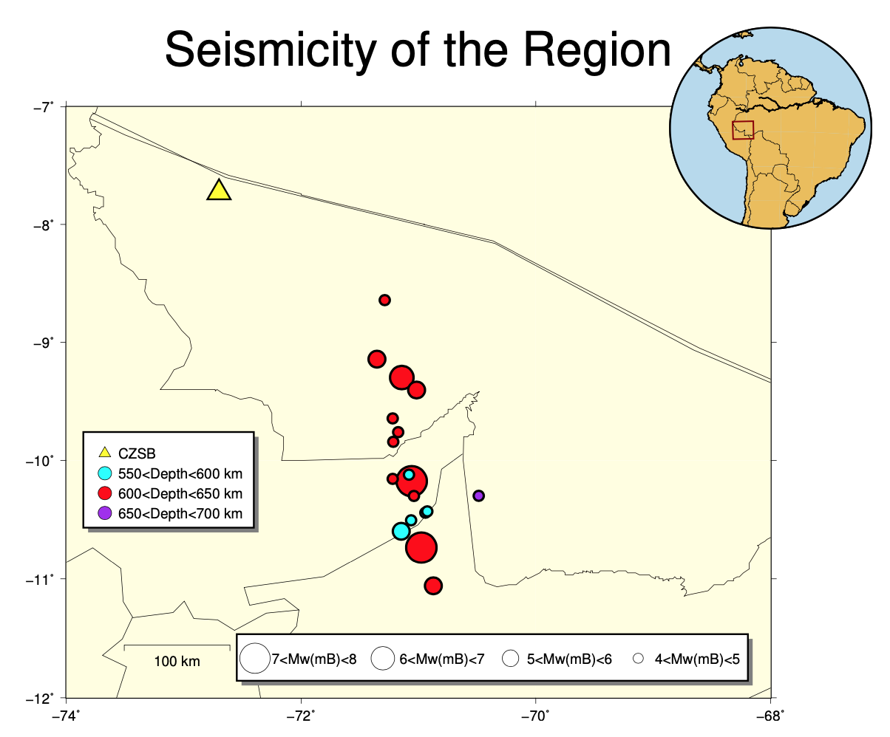
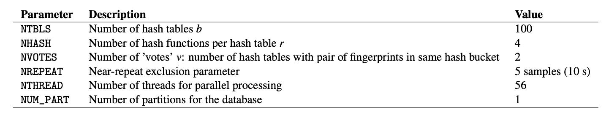
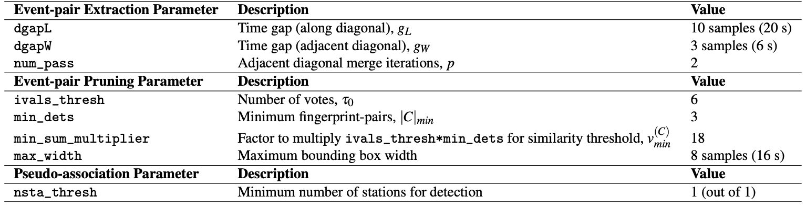

# BrazilAcre Data Set  

* Location: Acre, Brazil (search for intermediate-depth and deep earthquakes)  
* Duration: about 3 months (with time gaps): 2015-05-28 to 2016-02-01  
* Network: 1 station (Figure 14), 3 components (HHE, HHN, HHZ) = 3 channels. • Sampling rate: 100 Hz  
* Provided by: Marcelo de Bianchi (University of Sao Paulo)  

  

<figcaption>Figure 14: Acre, Brazil map provided by Marcelo de Bianchi: 1 station (yellow triangle) used for FAST detection, and locations of known catalog events (circles colored by depth).</figcaption>  

### 0.9.1 Preprocessing  

* Output continuous data duration: different stations used for detection have different durations and time gaps (need to modify paths in get_continuous_data_times.py):  

```
~/FAST/utils/preprocess/$ ../../parameters/preprocess/BrazilAcre/continuous_data_times_BrazilAcre.sh
```  

The output files in continuous_duration/ can be read into a custom script called plot_continuous_ duration_BrazilAcre.py to plot the duration of available continuous data at each station and channel (Figure 15).  

  

<figcaption>Figure 15: Duration of BrazilAcre continuous data at 1 station (3 components). White sections indicate time gaps.</figcaption>  

* Confirmed no zero-filled time-gap sections of continuous data in all 3 channels (need to modify paths in fill_ time_gaps_with_uncorrelated_noise.py):  

```
~/FAST/utils/preprocess/$ python fill_time_gaps_with_uncorrelated_noise.py
```  

**Use original mseed data files.**

* Output sample spectrograms on each channel and station to determine bandpass filter range (need to modify
paths in plot_sample_spectrograms.py):  

```
~/FAST/utils/preprocess/$ ../../parameters/preprocess/BrazilAcre/sample_spectrograms_BrazilAcre.sh
```  

* Apply bandpass filter and decimate (need to modify paths in bandpass_filter_decimate.py):  

```
~/FAST/utils/preprocess/$ ../../parameters/preprocess/BrazilAcre/bandpass_filter_decimate_BrazilAcre.sh
```  

Based on sample spectrograms, filter 3-20 Hz for all 3 channels. Decimate by a factor of 2, to 50 Hz sampling rate. Filtered continuous data files start with Deci2.bp3to20.*, which are input to the fingerprint step.  

* Need to add `.mseed` extension to all time series files, otherwise the Julian day number in the time series file gets removed while fingerprinting, and we cannot tell the difference between fingerprints from different days.  

### 0.9.2 Fingerprint  

Master script to create fingerprints on each channel, then generate global indices at the end:  

```
~/FAST/fingerprint/$ ../parameters/fingerprint/BrazilAcre/run_fp_BrazilAcre.sh
```  

Example script to generate fingerprints on one channel (HHE) at one station (CZSB), called by the master script run_fp_BrazilAcre.sh:  

```
~/FAST/fingerprint/$ python gen_fp.py ../parameters/fingerprint/BrazilAcre/fp_input_BR_CZSB_HHE.json
    "fingerprint": {
       "sampling_rate": 50,
       "min_freq": 3.0,
       "max_freq": 20.0,
       "spec_length": 10.0,
       "spec_lag": 0.2,
       "fp_length": 128,
         Continuous Data (Network.Station.Channel)
       "fp_lag": 10,
       "k_coef": 800,
       "nfreq": 32,
       "mad_sampling_rate": 0.1,
       "mad_sample_interval": 86400
    "data": {
       "station": "CZSB",
       "channel": "HHE",
       "start_time": "15-10-28T00:00:00.0",
       "end_time": "16-02-01T00:00:03.0",
       "folder": "/lfs/1/ceyoon/TimeSeries/BrazilAcre/CZSB/",
```  

There are a total of 3 `fp_input_NETWORK_STATION_CHANNEL.json` fingerprint input files, one for each channel and station, all with the same input fingerprint parameters in Table S25.  

Table S25: Fingerprint input parameters for BrazilAcre earthquake detection: 3-component at 1 station (Figure 14, yellow triangle), after bandpass filter 3-20 Hz, and decimated to 50 Hz sampling rate. The fingerprint sampling period is dt_fp = 2 seconds.  

  

Median/MAD output files: `mad/mad*.txt`  
Fingerprints (binary files): `fingerprints/CZSB.HHE.fp`  
Timestamps at each fingerprint index (text files): `timestamps/CZSB.HHE.ts`  

Finally, to create global indices for the BrazilAcre data set, so that fingerprint indices from different channels (all 3) and stations are referenced to a common starting time:  

```
$ python global_index.py ../parameters/fingerprint/BrazilAcre/global_indices_BrazilAcre.json
```  

The common starting time is in global_idx_stats.txt: 2015-10-28T00:00:21.340000 UTC  

### 0.9.3 Similarity Search  

Master script to run similarity search on each channel (out of 3 total):  

```
~/FAST/simsearch/$ ../parameters/simsearch/BrazilAcre/run_simsearch_BrazilAcre.sh
```  

Example script to run similarity search on one channel (HHE) at one station (CZSB), called by the master script `run_simsearch_BrazilAcre.sh`:  

```
~/FAST/simsearch/$ ../parameters/simsearch/BrazilAcre/filt_simsearch_input_BrazilAcre.sh CZSB HHE
NTBLS=100
NHASH=4
NREPEAT=5
NVOTES=2
NTHREAD=56
NUM_PART=1
```  

Table S26: Similarity search input parameters for BrazilAcre earthquake detection: 3 channels at 1 station (3
components each).  

  

The same input parameters are used for similarity search on all 3 channels (Table S26).  

### 0.9.4 Postprocessing  

**First**, run the master script to convert similarity search output from binary format to text format (3 columns: dt = idx1 − idx2, idx1, sim, sorted in increasing dt order) for each channel (3 total):  

```
~/FAST/postprocessing/$ ../parameters/postprocess/BrazilAcre/output_BrazilAcre_pairs.sh  
```  

For example, on one channel (HHE) at one station (CZSB), all on one line:  

```
~/FAST/postprocessing/$ python parse_results.py
-d /lfs/1/ceyoon/TimeSeries/BrazilAcre/CZSB/fingerprints/
-p candidate_pairs_CZSB_HHE -i /lfs/1/ceyoon/TimeSeries/BrazilAcre/global_indices/CZSB_HHE_idx_mapping.txt
```  

==Output file for example (large size at channel level):== /`lfs/1/ceyoon/TimeSeries/BrazilAcre/CZSB/fingerprints/ candidate_pairs_CZSB_HHE_merged.txt`  

**Second**, run the master script to combine similarity output from all 3 components at a given station, for 1 station:  

```
~/FAST/postprocessing/$ ../parameters/postprocess/BrazilAcre/combine_BrazilAcre_pairs.sh
```  

For example, on three channels (HHE, HHN, HHZ) at one station (CZSB), first move the similarity output text files to the inputs_network/ directory:  

```
$ cd /lfs/1/ceyoon/TimeSeries/BrazilAcre/CZSB/fingerprints/
$ mv candidate_pairs_CZSB_HH*_merged.txt ../../../inputs_network/
```  

Then for each similar fingerprint pair, add the similarity from all 3 components at the same station, with a similarity threshold of 6 = (3 components)*(v=2 votes/component, Table S26). Note: this step will delete the `candidate_ pairs_CZSB_HH*_merged.txt` files.  

```
~/FAST/postprocessing/$ python parse_results.py
-d /lfs/1/ceyoon/TimeSeries/BrazilAcre/inputs_network/
-p candidate_pairs_CZSB --sort true --parse false -c true -t 6
```  

==Output file for example (smaller size at station level):== `/lfs/1/ceyoon/TimeSeries/BrazilAcre/inputs_network/ candidate_pairs_CZSB_combined.txt`  


Finally, detect similar fingerprints across the network of 1 station, using the input parameters in Table S27 (Note: this step only aggregates similar event pairs from similar fingerprints, and resolves the pairs into a list of candidate events, since there is only 1 station.):  

```
~/FAST/postprocessing/$
python scr_run_network_det.py ../parameters/postprocess/BrazilAcre/1sta_1stathresh_network_params.json
       "network": {
              "max_fp": 4147182,
              "dt_fp": 2.0, (seconds)
              "dgapL": 10, (20 s)
              "dgapW": 3, (6 s)
              "num_pass": 2,
              "min_dets": 3,
              "min_sum_multiplier": 1,
              "max_width": 8, (16 s)
              "ivals_thresh": 6,
              "nsta_thresh": 1,
              "input_offset": 15 (30 s) <--- NOT USED
},  
```  

Table S27: Network detection input parameters for BrazilAcre at 1 station. max_fp = 4147182 is the largest fingerprint index over all channels from *mapping.txt files in the global_indices directory. dt_fp = 2 seconds is the fingerprint sampling period from Table S25.  

  


Network detection output file: `/lfs/1/ceyoon/TimeSeries/BrazilAcre/network_detection/1sta_1stathresh_detlist_rank_by_peaksum.tx`t (14,477 events)  

At this point, FAST earthquake detection processing is done.  

### 0.9.5 Remove duplicates after network detection  

Sort events in descending order of peaksum (peak similarity score between similar fingerprints) for the final detection list.  

```
~/FAST/utils/network/$ ./final_single_station_sort_nsta_peaksum.sh
```  

==Output:== `sort_peaksum_1sta_1stathresh_CZSB_events.txt` (14,477 events)  

### 0.9.6 Visual inspection and final detections  

Plot event waveforms in the final detection list, ranked in descending order of peaksum (peak similarity score between similar fingerprints), for visual inspection. Need to verify by looking at the waveforms that these are indeed earthquakes, and also enables setting final detection thresholds (peaksum ≥ 6).  

```
~/FAST/utils/events/$ python PARTIALplot_detected_waveforms_BrazilAcre.py 0 14477
```  

==Output:== `.png` image files in `1sta_1stathresh_NetworkWaveformPlots/` (zip file)  

Visual inspection shows that there are many false detections that do not look like earthquake waveforms (for example, `event_rank00000_peaksum116351_ind854248_time1708496.0_2015-11-16T18/35/17.340000.png`). However, some earthquake waveforms (for example, `event_rank00049_peaksum26898_ind1297608_time2595216`. `0_2015-11-27T00/53/57.340000.png`) are also detected. **I suggest running FAST on at least 3 stations for reliable earthquake detection.**  

14,474 events are above the arbitrary low threshold (peaksum ≥ 6).  

  * `EQ_sort_peaksum_1sta_1stathresh_CZSB_events.txt`  

For the 14,474 events, output a catalog-like formatted list:  

```
~/FAST/utils/events/$ python output_final_detection_list.py
```  

==Output:== `FINAL_Detection_List_BrazilAcre_1sta_1stathresh_peaksum6.txt` (14,474 events)  
