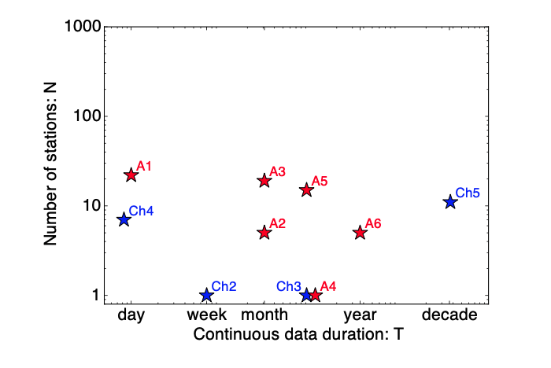

# **Example Parameters**

## Introduction  

FAST is available to the public at [https://github.com/stanford-futuredata/FAST](https://github.com/stanford-futuredata/FAST) as open-source software, and it will be released with a comprehensive user manual containing guidance for setting parameters. Interested users can run FAST to perform an uninformed search for earthquakes with similar waveforms on any seismic network, with varying duration of continuous data and number of stations. The FAST software has successfully detected earthquakes in the following data sets. FAST will only reach its full potential as a tool for seismological discovery if other users apply it to their own data sets (filling the N and T gaps in Figure 1) and improve the detection algorithms. Thank you to all collaborators and interested users who shared data, which was useful for testing the FAST software and identifying bug fixes, in preparation for its public release.  

  

<figcaption>Figure 1: Dimensions of different data sets where FAST has successfully detected similar earthquakes. The log-scale axes represent the directions of data growth in seismology to ”large-T” and ”large-N” big data sets (Chapters 1 and 5): T is the longest duration of continuous data over all stations in the data set, while N is the number of seismic stations in the data set. Blue stars: data sets from Chapters 2-5. Red stars: additional data sets from Appendix A, Sections A.1-A.6.</figcaption>  

## ItalyDayYR Data Set  

One day of continuous data, 2016-10-29 00:00:00 to 2016-10-29 23:59:59 UTC, at 22 stations in central Italy (Figure 2), used 22 channels (vertical component HHZ only on each channel) for detection, provided by Bill Ellsworth. This data records small earthquakes from a swarm in Central Italy during October 2016, that occurred between the Mw 6.1 earthquake on 2016-10-26 19:18:08 UTC and the Mw 6.6 Norcia earthquake on 2016-10-30 06:40:18 UTC.  

  

<figcaption>Figure 2: Map of 22 stations (black triangles) in central Italy used for FAST detection of small earthquakes on 2016-10-29, one day of continuous data. The INGV catalog (http://cnt.rm.ingv.it/search) had 482 earthquakes (circles colored by depth, sized by relative magnitudes 0.4 ≤ M ≤ 4.1) inside the boundaries of this map on 2016-10-29.</figcaption>  

### Preprocessing  

Output sample spectrograms on each channel and station to determine bandpass filter range:  

```
~/FAST/utils/preprocess/$ ../../parameters/preprocess/ItalyDayYR/sample_spectrograms_ItalyDayYR.sh
```  

Table S2: FAST input parameters for Italy earthquake detection: single-channel at 22 YR stations (Figure 2, black triangles), after bandpass filter 2-20 Hz, and decimate to 25 Hz. Total number of fingerprints: 71,989.  

<!-- | FAST Parameter      | Value                          |
| ----------- | ------------------------------------ |
| Time series window length for spectrogram generation       |     150 samples (6 s)  |
| Time series window lag for spectrogram generation       |  3 samples (0.12 s) |
| Spectral image window length      |  64 samples (13.68 s) |
| Spectral image window lag = fingerprint sampling period    |      10 samples (1.2 s) |
| Number of top k amplitude standardized Haar coefficients       |  400 (out of 2048) |
| LSH: number of hash functions per hash table r       |  4 |
| LSH: number of hash tables b       |  100 |
| Initial pair threshold: number v (fraction) of tables, pair in same bucket       |  2 (2/100 = 0.02) |
| Similarity search: near-repeat exclusion parameter       |  5 samples (6 s) | -->

  

Table S3: Network detection input parameters for Italy earthquakes at 22 YR stations (HHZ channel only), after getting similar pairs of fingerprints from FAST for each station.  

  

  

<figcaption>Figure 3: Distribution of FAST detections in central Italy continuous data on 2016-10-29. FAST detected a total of 1,485 earthquakes during this day.</figcaption>