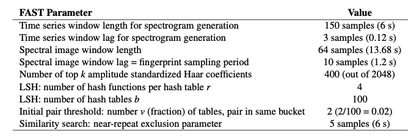
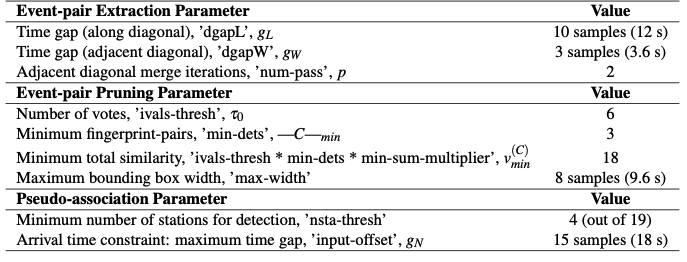
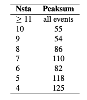
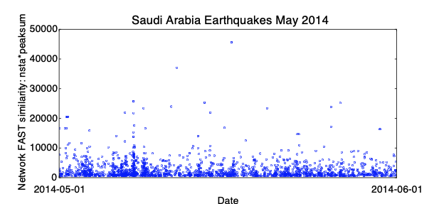

# **Example Parameters**

## 0.1 Introduction  

FAST is available to the public at [https://github.com/stanford-futuredata/FAST](https://github.com/stanford-futuredata/FAST) as open-source software, and it will be released with a comprehensive user manual containing guidance for setting parameters. Interested users can run FAST to perform an uninformed search for earthquakes with similar waveforms on any seismic network, with varying duration of continuous data and number of stations. The FAST software has successfully detected earthquakes in the following data sets. FAST will only reach its full potential as a tool for seismological discovery if other users apply it to their own data sets (filling the N and T gaps in Figure 1) and improve the detection algorithms. Thank you to all collaborators and interested users who shared data, which was useful for testing the FAST software and identifying bug fixes, in preparation for its public release.  

  

<figcaption>Figure 1: Dimensions of different data sets where FAST has successfully detected similar earthquakes. The log-scale axes represent the directions of data growth in seismology to ”large-T” and ”large-N” big data sets (Chapters 1 and 5): T is the longest duration of continuous data over all stations in the data set, while N is the number of seismic stations in the data set. Blue stars: data sets from Chapters 2-5. Red stars: additional data sets from Appendix A, Sections A.1-A.6.</figcaption>  

## 0.2 `ItalyDayYR` Data Set  

!!! info  
    One day of continuous data, 2016-10-29 00:00:00 to 2016-10-29 23:59:59 UTC, at 22 stations in central Italy (Figure 2), used 22 channels (vertical component HHZ only on each channel) for detection, provided by Bill Ellsworth. This data records small earthquakes from a swarm in Central Italy during October 2016, that occurred between the Mw 6.1 earthquake on 2016-10-26 19:18:08 UTC and the Mw 6.6 Norcia earthquake on 2016-10-30 06:40:18 UTC.  

  

<figcaption>Figure 2: Map of 22 stations (black triangles) in central Italy used for FAST detection of small earthquakes on 2016-10-29, one day of continuous data. The INGV catalog (http://cnt.rm.ingv.it/search) had 482 earthquakes (circles colored by depth, sized by relative magnitudes 0.4 ≤ M ≤ 4.1) inside the boundaries of this map on 2016-10-29.</figcaption>  

### 0.2.1 Preprocessing  

Output sample spectrograms on each channel and station to determine bandpass filter range:  

```
~/FAST/utils/preprocess/$ ../../parameters/preprocess/ItalyDayYR/sample_spectrograms_ItalyDayYR.sh
```  

Table S2: FAST input parameters for Italy earthquake detection: single-channel at 22 YR stations (Figure 2, black triangles), after bandpass filter 2-20 Hz, and decimate to 25 Hz. Total number of fingerprints: 71,989.  

<!-- | FAST Parameter      | Value                          |
| ----------- | ------------------------------------ |
| Time series window length for spectrogram generation       |     150 samples (6 s)  |
| Time series window lag for spectrogram generation       |  3 samples (0.12 s) |
| Spectral image window length      |  64 samples (13.68 s) |
| Spectral image window lag = fingerprint sampling period    |      10 samples (1.2 s) |
| Number of top k amplitude standardized Haar coefficients       |  400 (out of 2048) |
| LSH: number of hash functions per hash table r       |  4 |
| LSH: number of hash tables b       |  100 |
| Initial pair threshold: number v (fraction) of tables, pair in same bucket       |  2 (2/100 = 0.02) |
| Similarity search: near-repeat exclusion parameter       |  5 samples (6 s) | -->

  

Table S3: Network detection input parameters for Italy earthquakes at 22 YR stations (HHZ channel only), after getting similar pairs of fingerprints from FAST for each station.  

  

  

<figcaption>Figure 3: Distribution of FAST detections in central Italy continuous data on 2016-10-29. FAST detected a total of 1,485 earthquakes during this day.</figcaption>  

## 0.3 Tanzania, August 2016  

Temporary dense deployment of seismic stations in Tanzania to identify previously unknown faults and infer their dimensions. 1 month continuous data (2016-07-31 to 2016-08-31), at 5 stations, 15 channels (3 components per station), provided by Laura Parisi of King Abdullah University of Science and Technology (KAUST). The stations are located about 10 km apart, at the base of a volcanic caldera called Ngorongoro Crater. For all 15 channels, we applied the following preprocessing: 4-12 Hz bandpass filter, then decimated to 25 Hz (factor of 8, from original 200 Hz); also, all time gaps with 0’s were filled with uncorrelated random noise (only on station CES04).  


Table S4: FAST input parameters for Tanzania earthquake detection, applied to each component at all 5 stations. For the median statistics calculation (for wavelet coefficient selection), we randomly sampled 10% of the data, once per day. Total number of fingerprints (largest number over all channels): 2,231,989.  

  

Table S5: Network detection input parameters for Tanzania earthquakes at 5 stations, after getting similar pairs of fingerprints from FAST for each station — added similarity from all 3 [HNE,HNN,HNZ] components at a given station and set station-pair threshold of (v=2)*(3 components) = 6.  

  

Table S6: Final thresholds for Tanzania earthquakes, applied to network detection parameters *nsta* (number of stations that detected event pair) and *peaksum* (total similarity score at all stations) to determine list of earthquakes, set empirically after visual inspection. For each value of *nsta*, a different threshold for *peaksum* can be applied.  

  

  

<figcaption>Figure 4: Tanzania earthquake detections from 2016-07-31 to 2016-08-31. The vertical axis indicates a measure of network FAST similarity: nsta*peaksum (Table S6). FAST detected a total of 1,156 earthquakes during this month. Some false positive detections had to be removed manually, especially detections on only 2 out of 5 stations.</figcaption>  

## 0.4 Saudi Arabia, May 2014


<figcaption>Figure 5: Map of 19 stations (white triangles) in Saudi Arabia used for FAST detection from 2014-05-01 to 2014-06-01. Catalog earthquakes are colored by depth; mantle earthquakes are circled. This figure was created by Alex Blanchette.</figcaption>  


!!! info
    Seismic network from Saudi Arabia to study dike swarms in volcanic area, and deep mantle earthquakes. 1 month continuous data (2014-05-01 to 2014-06-01), at 19 stations (Figure 5), 55 channels (3 components per station, except LNY11 where only HHN was used), provided by Alex Blanchette of Stanford Geophysics.  

Table S7: Preprocessing parameters for Saudi Arabia May 2014 earthquake detection, for each station (same filter applied to all components), 1 month continuous data (2014-05-01 to 2014-06-01), at 19 stations, decimate to 25 Hz. Also, all time gaps with 0’s were filled with uncorrelated random noise. For station LNY11, only HHN component was used in similarity search, as the HHE and HHZ components had too much correlated noise.  

  


Table S8: FAST input parameters for Saudi Arabia May 2014 earthquake detection, applied to each component at each station. For the median statistics calculation (for wavelet coefficient selection), we randomly sampled 10% of the data, once per day. Total number of fingerprints (largest number over all channels): 2,231,989.  

  

Table S9: Network detection input parameters for Saudi Arabia May 2014 earthquake detection at 19 stations, after getting similar pairs of fingerprints from FAST for each station — added similarity from all 3 [HHE,HHN,HHZ] components at a given station and set station-pair threshold of (v=2)*(3 components) = 6.  

  

Table S10: Final thresholds for Saudi Arabia May 2014 earthquake detection, applied to network detection parameters *nsta* (number of stations that detected event pair) and *peaksum* (total similarity score at all stations) to determine list of earthquakes, set empirically after visual inspection. For each value of *nsta*, a different threshold for *peaksum* can be applied.  

  

  

<figcaption>Figure 6: Saudi Arabia earthquake detections from 2014-05-01 to 2014-06-01. The vertical axis indicates a measure of network FAST similarity: nsta*peaksum (Table S10). FAST detected a total of 1,837 earthquakes during this month.</figcaption>  

## 0.5 `SaudiFull` data set: Saudi Arabia, January - May 2017  

* Location: Saudi Arabia, January - May 2017 (volcanic area with dikes)  
* Duration: up to 5 months (151 days): 2017-01-01 to 2017-05-30  
* Network: 36 stations, 3 components each (HHE, HHN, HHZ) = 106 channels. (Station SA.UMJ02: only HHE channel)  
* Sampling rate: 100 Hz  
* Provided by: Mohammad Youssof (KAUST)  

### 0.5.1 Preprocessing  

* Output continuous data duration: different stations used for detection have different durations and time gaps (need to modify paths in get_continuous_data_times.py):  

```
~/FAST/utils/preprocess/$ ../../parameters/preprocess/SaudiFull/continuous_data_times_SaudiFull.sh
```  

The output files in `continuous_duration/` can be read into a custom script called `plot_continuous_ duration_SaudiFull.py` to plot the duration of available continuous data at each station and channel (Figure 7).  

  

<figcaption>Figure 7: Duration of SaudiFull continuous data at 36 stations (change colors with each station), 3 components each (except SA.UMJ02 which has only HHE). White sections indicate time gaps.</figcaption>

* Detected zero-filled time-gap sections of continuous data in all 106 channels (need to modify paths in fill_ time_gaps_with_uncorrelated_noise.py), and filled them with random uncorrelated noise:  

```
~/FAST/utils/preprocess/$ python fill_time_gaps_with_uncorrelated_noise.py  
```  

Only stations SA.UMJ03, SA.UMJ05, SA.UMJ08 had zero-filled time-gap sections, which were filled with random noise and saved as files starting with the `Filled.*` string. The majority of continuous data files had no zero-filled time gaps, so we used original mseed data files.  

* Output sample spectrograms on each channel and station to determine bandpass filter range (need to modify paths in plot_sample_spectrograms.py):  

```
~/FAST/utils/preprocess/$ ../../parameters/preprocess/SaudiFull/sample_spectrograms_SaudiFull.sh
```  

* Apply bandpass filter and decimate (need to modify paths in bandpass_filter_decimate.py):  

```
~/FAST/utils/preprocess/$ ../../parameters/preprocess/SaudiFull/bandpass_filter_decimate_SaudiFull.sh
```  

Based on sample spectrograms, apply a station-specific bandpass filter (Table S11). Decimate by a factor of 2 to a sampling rate of 50 Hz. Filtered continuous data files start with `Deci2.bpXtoY.*`, where X is the lower frequency and Y is the higher frequency, which are input to the fingerprint step.  

Table S11: Preprocessing parameters for SaudiFull earthquake detection, for each station (same filter applied to all components), 5 months continuous data (2017-01-01 to 2017-05-31), at 36 stations, decimate to 50 Hz.  

  

### 0.5.2 Fingerprint  

Master script to create fingerprints on each channel, then generate global indices at the end:  

```
~/FAST/fingerprint/$ ../parameters/fingerprint/SaudiFull/run_fp_SaudiFull.sh
```  

Example script to generate fingerprints on one channel (HHZ) at one station (LNY03), called by the master script run_fp_SaudiFull.sh:  

```
~/FAST/fingerprint/$ python gen_fp.py ../parameters/fingerprint/SaudiFull/fp_input_SA_LNY03_HHZ.json
    "fingerprint": {
       "sampling_rate": 50,
       "min_freq": 4.0,
       "max_freq": 15.0,
       "spec_length": 6.0,
       "spec_lag": 0.12,
       "fp_length": 64,
       "fp_lag": 10,
       "k_coef": 400,
       "nfreq": 32,
       "mad_sampling_rate": 0.1,
       "mad_sample_interval": 86400
    "data": {
       "station": "LNY03",
       "channel": "HHZ",
       "start_time": "17-01-01T00:00:00.0",
       "end_time": "17-05-31T00:00:00.0",
       "folder": "/lfs/1/ceyoon/TimeSeries/SaudiFull/SA.LNY03/",
```  