# **Fingerprint**

## Feature Extraction Overview

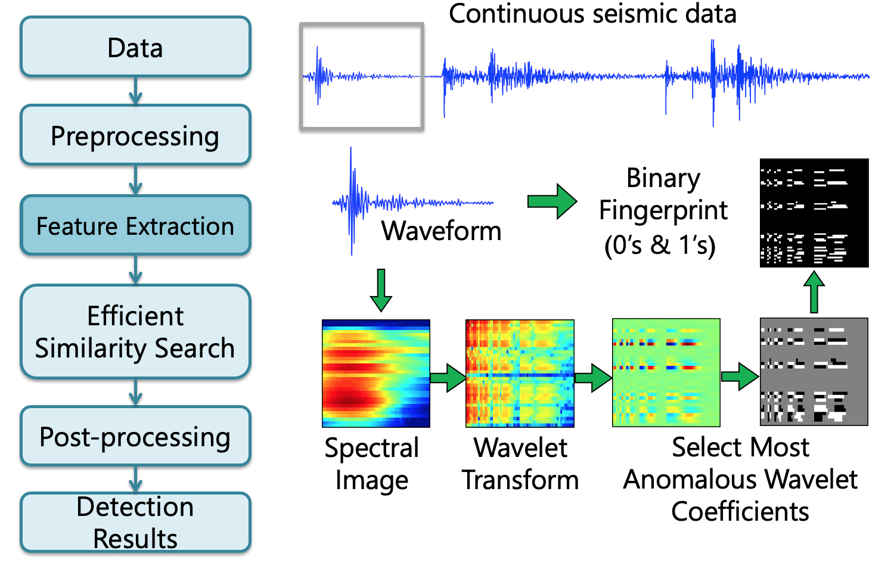  

### Step 1: Time Series --> Spectrogram

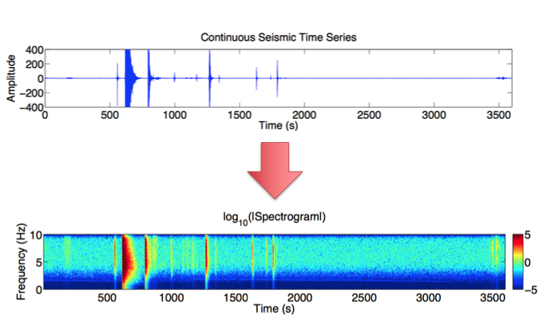

### Step 2: Spectrogram --> Spectral Images

* To find short duration events, divide spectrogram into overlapping spectral images  
    * Long lag --> fewer spectral images to compare --> fast

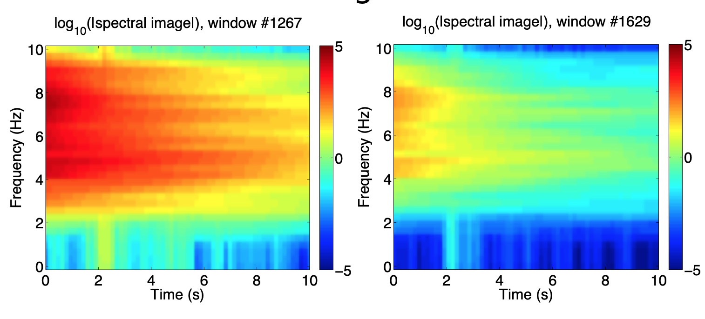  

### Step 3: Spectral Image --> Wavelet Transform

* Goal: compress nonstationary seismic signal  
    * Compute 2D discrete wavelet transform (Haar basis) of spectral image to get wavelet coefficients

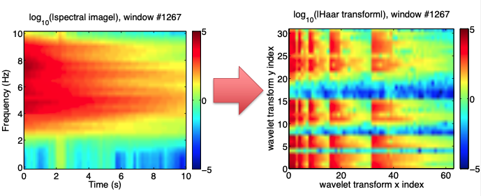  

### Step 4: Spectrogram --> Spectral Images  

* Key discriminative features are concentrated ina few wavelet coefficients with highest deviation  
    * Deviation defined by median/MAD over entire data set
    * Keep only sign (+ or -) of these coefficients, set rest to 0
* Data compression, robust to noise

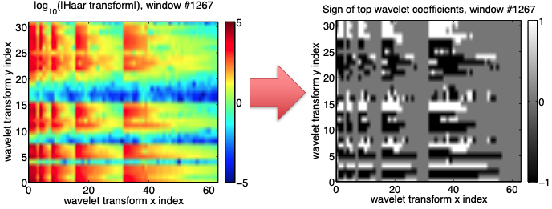  

### Step 5: Spectrogram --> Spectral Images  

* Fingerprint must be compact and sparse to store in database  
    * Convert top coefficients to a binary sequence of 0’s, 1’s
        * Negative: 01, Zero: 00, Positive: 10

  

### How do we measure similarity?  

  

### Fingerprint parameters

```
{
    "fingerprint": {
        "sampling_rate": 20,                # Sampling rate (Hz)
        "min_freq": 0.0,                    # Bandpass frequency (Hz) - minimum
        "max_freq":, 10.0,                  # Bandpass frequency (Hz) – maximum
        "spec_length": 6.0,                 # Time window length (s) for spectrogram
        "spec_lag": 0.2,                    # Time window lag (s) for spectrogram
        "fp_length": 32,                    # Spectral image length (samples)
        "fp_lag": 5,                        # Spectral image lag (samples)
        "k_coef": 200,                      # Number of wavelet coefficients to keep
        "nfreq": 32,                        # Final spectral image width (samples)
        "mad_sampling_rate": 1,             # Median/MAD sampling fraction of data
        "mad_sampling_interval": 86400      # Median/MAD sampling frequency (s)
    }
}
```  

!!! note
    Need one input file per component at each station:  
    ```
    parameters/fingerprint/fp_input_${NETWORK}_${STATION}_${CHANNEL}.json
    ```  
    **Example:** `fp_input_CI_CDY_EHZ.json`  

### How to select bandpass filter?  

* Filter can be different for different stations and components  
* Contain as much of your desired earthquake signal as possible; not too narrowband  
* Remove frequencies with repeated noise: ^^important^^  
  * View sample spectrograms to empirically determine these noisy frequencies (output as .png image files):
  ```
parameters/preprocess_utils/sample_spectrograms_daily _NEP.py
  ```
      * Twice a day (day and night: cultural noise variations)
      * Once a month or once a day – sample randomly

  * Usually 0-2 Hz has repeated noise; sometimes >20 Hz
  * ^^Without this step, similar noise signals will dominate your detections --> you will not find earthquakes^^  

* May want to avoid teleseismic event detection
    * Lower limit 3-4 Hz

* 4-12 Hz generally works well as default

### **Example:** Bandpass filter selection, given sample spectrogram  

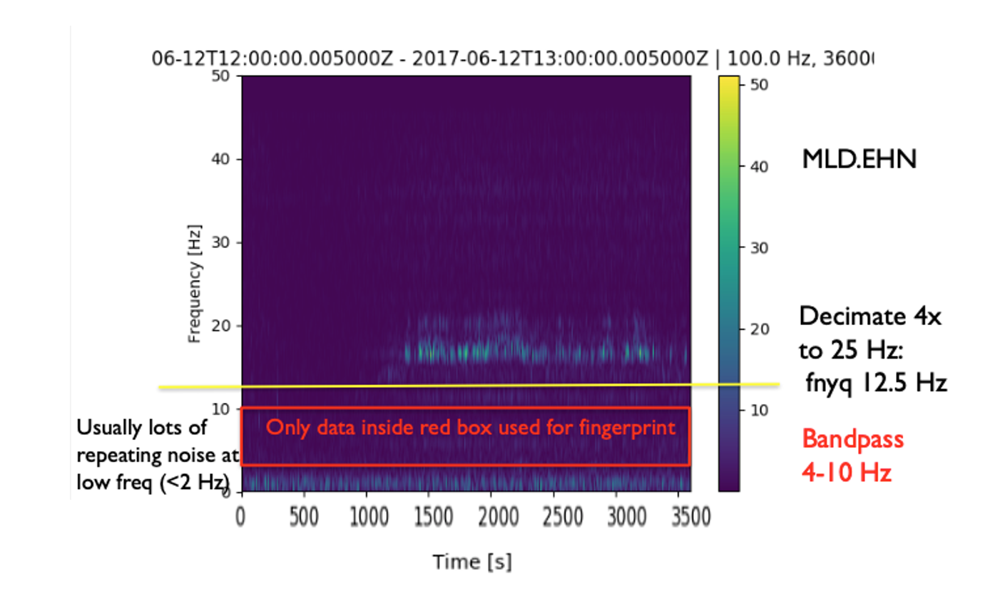  

```
"spec_length": 6.0,     # Time window length (s) for spectrogram
"spec_lag": 0.2,        # Time window lag (s) for spectrogram
"fp_length": 32,        # Spectral image length (samples)
"fp_lag": 5,             # Spectral image lag (samples)
```  

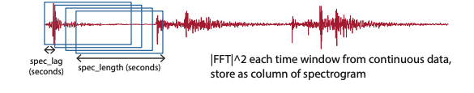

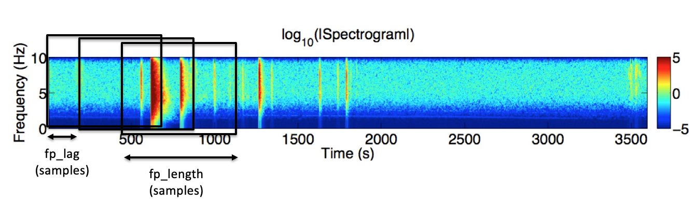  

!!! info
    Spectral image (and fingerprint) length: 12.4 seconds  
    Spectral image (and fingerprint) lag: 1 second  

* Choose parameters so that entire earthquake waveform (P,S,coda) fits into `fp_length` time window  
    * Not too short (just P or S arrival), but not too long (otherwise adds noise)  
    * Choose same parameters for all components at all stations  
    * Adjust `spec_length` and `fp_length` values  
    * `fp_length` (samples) should be a power of 2  
        * Required for the wavelet transform. If `fp_length` is not a power of 2, each spectral image will be downsampled to the next smallest power of 2.  

* `spec_lag` should be short with >95% overlap between adjacent time windows; 0.05 to 0.2 seconds is a good default  
* `fp_lag`: can be slightly longer with >85% overlap between adjacent spectral images; 0.5 to 2 seconds is a good default  

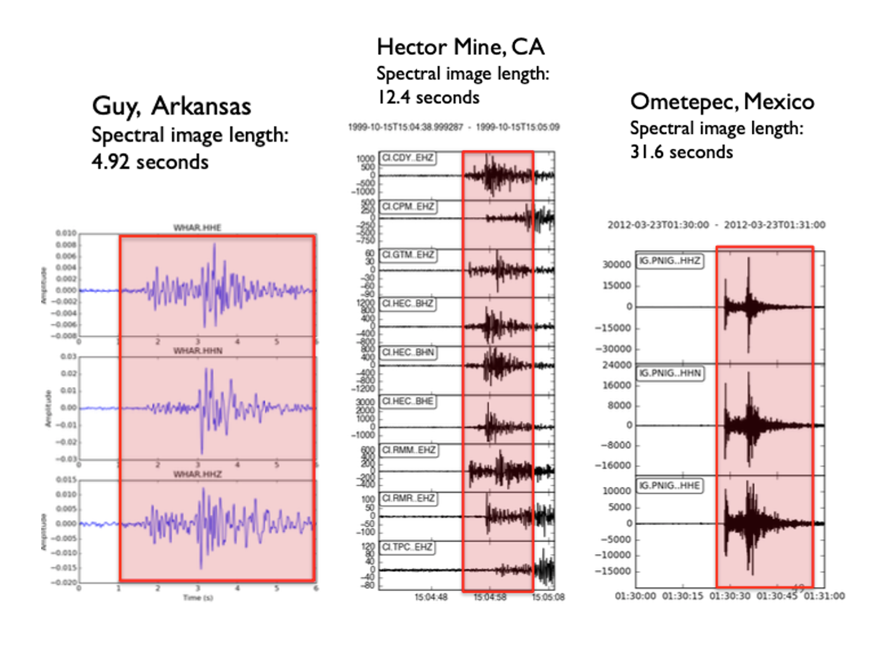  

```
"k_coef": 200,      # Number of wavelet coefficients to keep  
"nfreq": 32,        # Final spectral image width (samples)  
```  

* Spectral image width will be resized (usually downsampled) to `nfreq` samples  
    * Initial spectral image width is 2*(`spec_length`)*(`max_freq` - `min_freq`) samples: depends on bandpass filter  
    * `nfreq` must be a power of 2 for wavelet transform; 32 is good default value  
* Each spectral image (and wavelet-transform) has dimensions = `nfreq` * `fp_length`  
    * This example: 32*32 = 1024 elements  
* To set `k_coef`, keep ~20% of most anomalous wavelet coefficients  
    * This example: 200/1024 ~ 19.5%
* Fingerprint has twice as many elements as spectral image  
    * This example: 2 * 1024 = 2048 elements  

### FAST Fingerprints: Sparsity Parameter  


```
"mad_sampling_rate": 1,          # Median/MAD sampling fraction of data
"mad_sample_interval": 86400,    # Median/MAD sampling interval (s)
```

* For each coefficient, compute median/MAD statistics over entire data set. This step determines which `k_coef` wavelet coefficients to keep.  
    * But if data set is too long (months-years), compute statistics over a representative sample of data  
* `mad_sampling_rate`: fraction of entire continuous data set used to compute median/MAD  
    * Duration of sampled data set = (`mad_sampling_rate`) * (continuous data duration) should not exceed 1 week, otherwise may not fit in memory
* Retrieve sample of data for median/MAD statistics once per `mad_sample_interval`  
    * 86400 s = 1 day is a good default value
    * Exact time of sample is determined ^^randomly^^: expect different numbers every time you run this
* Median/MAD for each coefficient: pre-computed and stored in a text file, then read in during fingerprint generation  
    * `data/waveforms${STATION}/mad/mad*.txt`  


* Rule of thumb
    * Duration <1 week: set to 1 (use entire data set for sample)
    * Duration weeks – months: set to 0.1 (sample 10% of data)
    * Duration >1 year: set to 0.01 (sample 1% of data)

* Runtime-accuracy tradeoff

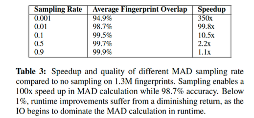  

```
"performance": {
    "num_fp_thread": 8,         # Number of parallel processes  
    "partition_len": 86400      # Continuous data partition (s)  
},
```  

* Can generate fingerprints in parallel by setting `num_fp_thread` > 1  
    * Each process gets one continuous data file
        * Better parallelization if you have one mseed file per day, rather than one per month

* Generate fingerprints `partition_len` at a time  
    * 86400 s (1 day) is a good default value  

* Changing these “performance” parameters should not affect the final results  

```
"data": {
    "station": "CDY",  
    "channel": "EHZ",  
    "start_time": "99-10-15T13:00:00.0",                    # Time format: YY-MM-DDTHH:MM:SS.S  
    "end_time": "99-10-16T09:46:44.0",  
    "folder": "../data/waveformsCDY/",                      # folder with input data  
    "fingerprint_files": [                                  # Usually finerprint_files, MAD_samples_files should be the same; can have list of multiple files for input continuous data
        "Deci5.Pick.19991015130000.CI.CDY.EHZ.sac"],  
        "MAD_sample_files": [  
            "Deci5.Pick.19991015130000.CI.CDY.EHZ.sac"]  
}
```

* **OUTPUTS** 
    * `${folder}/fingerprints/`  
        * Fingerprints from each continuous data file (can delete these later): `fp_*`  
        * Single file with all fingerprints: `${STATION}.${CHANNEL}.fp`  
        * **For example:** `data/waveformsCDY/fingerprints/CDY.EHZ.fp`  
    * `${folder}/timestamps/`
        * Timestamp (YYYY-MM-DDTHH:MM:SS.SSS) for each fingerprint
        * Timestamps from each continuous data file (used later for global index calculation): `ts_*`

### Global Index: Inputs & Outputs

* Input file: `global_indices.json`  

```
{
    "index_folder": "../data/global_indices/",                              # Output folder
    "fp_param_dir": "../parameters/fingerprint/",                           # Input folder
    "fp_params": ["fp_input_CI_TPC_EHZ.json", "fp_input_CI_RMR_EHZ.json",   # Fingerprint input files for all components and stations to use for detection
    "fp_input_CI_RMM_EHZ.json”, "fp_input_CI_HEC_BHE.json“, 
    "fp_input_CI_HEC_BHN.json", "fp_input_CI_HEC_BHZ.json“, 
    "fp_input_CI_CPM_EHZ.json", "fp_input_CI_GTM_EHZ.json", 
    "fp_input_CI_CDY_EHZ.json"]
}
```

* Outputs:
    * Global start time “t0” for index 0 (YYYY-MM-DD THH:MM:SS.SSS), fingerprint input file names: `global_idx_stats.txt`  
    * Global index files for each channel, containing global index of each fingerprint: `${STATION}_${CHANNEL}_idx_mapping.txt`

  

## Fingerprint Examples from GitHub

Click [here](https://github.com/stanford-futuredata/FAST/tree/master/parameters/fingerprint) for more example fingerprint parameters such as:  

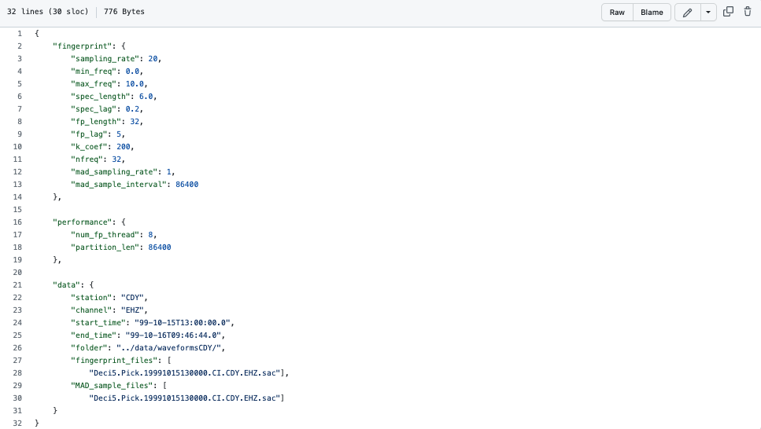  

!!! info
    File can be found in `FAST/parameters/fingerprint/fp_input_CI_CDY_EHZ.json`  

Click [here](https://github.com/stanford-futuredata/FAST/blob/master/parameters/fingerprint/run_fp_HectorMine.sh) for an example fingerprint script such as:  

  

!!! info
    File can be found in `FAST/parameters/fingerprint/run_fp_HectorMine.sh`  
