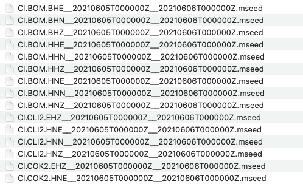

# Getting Seismic Data  

Using Obspy, users can download seismic data with [`get_waveforms`](https://docs.obspy.org/packages/autogen/obspy.clients.fdsn.client.Client.get_waveforms.html) or [mass downloader](https://docs.obspy.org/packages/autogen/obspy.clients.fdsn.mass_downloader.html).  

Example using `get_waveforms`:  
```
from obspy import UTCDateTime
from obspy import Stream
from obspy import read
from obspy.clients.fdsn import Client
import os
import json

t = UTCDateTime(2021, 6, 5, 10, 55, 58) # largest event time

start_time = UTCDateTime("2021-06-05 00:00:00")
end_time = UTCDateTime("2021-06-06 00:00:00")

# Earthquake longitude, latitude, depth
lon = -115.635
lat = 33.140
depth = 5.8

chan_priority_list=["HHZ", "HHN", "HHE", "HH1", "HH2",
                    "BHZ", "BHN", "BHE", "BH1", "BH2",
                    "EHZ", "EHN", "EHE", "EH1", "EH2",
                    "HNZ", "HNN", "HNE", "HN1", "HN2"]

# Clients to get waveforms
client1 = Client("IRIS")
client2 = Client("SCEDC")

# Get stations from IRIS within 50km from the earthquake
IRIS_inventory = client1.get_stations(
    starttime=start_time, endtime=end_time,
    longitude=lon, latitude=lat, maxradius=0.5)

# Get stations from SCEDC within 50km from the earthquake
SCEDC_inventory = client2.get_stations(
    starttime=start_time, endtime=end_time,
    longitude=lon, latitude=lat, maxradius=0.5)

# Get dictionary containing the contents of the objects
IRIS_contents = IRIS_inventory.get_contents()
SCEDC_contents = SCEDC_inventory.get_contents()

# File format
start_time_file = (f"{start_time.year}{str(start_time.month).zfill(2)}{str(start_time.day).zfill(2)}T{str(start_time.hour).zfill(2)}{str(start_time.minute).zfill(2)}{str(start_time.second).zfill(2)}Z")
end_time_file = (f"{end_time.year}{str(end_time.month).zfill(2)}{str(end_time.day).zfill(2)}T{str(end_time.hour).zfill(2)}{str(end_time.minute).zfill(2)}{str(end_time.second).zfill(2)}Z")

# Get waveforms from IRIS
os.mkdir("waveforms_IRIS")
st_list = []
for i in IRIS_contents["stations"]:
    curr = i.split()
    
    network = curr[0].split('.')[0]
    station = curr[0].split('.')[1]
    try:
        wave_form = client1.get_waveforms(network, station, "*", "*", start_time, end_time)

    except:
        print(f"No data available for {network}.{station}")
        
    for s in wave_form:

        if s.stats.channel in chan_priority_list:
            s.write(f"waveforms_IRIS/{s.stats.network}.{s.stats.station}.{s.stats.channel}__{start_time_file}__{end_time_file}.mseed", format="MSEED")
            
            if s.stats.station not in st_list:
                st_list.append(s.stats.station)

# Get waveforms from SCEDC
os.mkdir("waveforms_SCEDC")
st_list = []
for i in SCEDC_contents["stations"]:
    curr = i.split()

    network = curr[0].split('.')[0]
    station = curr[0].split('.')[1]
    
    try:
        wave_form = client2.get_waveforms(network, station, "*", "*", start_time, end_time)

    except:
        print(f"No data available for {network}.{station}")

    for s in wave_form:

        if s.stats.channel in chan_priority_list:
            s.write(f"waveforms_SCEDC/{s.stats.network}.{s.stats.station}.{s.stats.channel}__{start_time_file}__{end_time_file}.mseed", format="MSEED")

            if s.stats.station not in st_list:
                st_list.append(s.stats.station)
```

Example using mass downloader:  
```
import os
import obspy
from obspy.clients.fdsn.mass_downloader import CircularDomain, \
    Restrictions, MassDownloader

# Earthquake origin time
origin_time = obspy.UTCDateTime(2021, 6, 5, 10, 55, 58)

# Set up a circular domain with a maximum radius of 50km
domain = CircularDomain(latitude=33.140, longitude=-115.635, minradius=0, maxradius=0.5)

# Make directories to save miniseed waveform files and station information
os.makedirs("waveforms_mdl")
os.makedirs("stations_mdl")

# Add restrictions to downloaded data such as start time, end time, and channel priorities
restrictions = Restrictions(
    starttime = obspy.UTCDateTime("2021-06-05 00:00:00"),
    endtime = obspy.UTCDateTime("2021-06-06 00:00:00"),
    reject_channels_with_gaps=True,
    minimum_length=0,
    channel_priorities=["HH[ZNE12]", "BH[ZNE12]", "EH[ZNE12]", "HN[ZNE12]"])

# Select Clients to get waveforms from
mdl = MassDownloader(providers=["IRIS", "SCEDC"])

mdl.download(domain, restrictions, mseed_storage="waveforms_mdl",
             stationxml_storage="stations_mdl")
```

After saving waveforms to your directory, there may be multiple channels for one stations.  
  

In the image shown above, there are multiple channels for CI.BOM, CI.CLI2, and CI.COK2. You do not need all of the channels. Instead, refer to this priority list to know which channels to keep for running FAST:  

1. HH: High Broad Band; Sampling rate 100x per second
2. BH: Broad Band; Sampling rate 40x per second
3. EH: Extremely Short Period
4. HN: Measures how much the ground movement is accelerating; not good for finding small earthquakes  

Read more [here](https://ds.iris.edu/ds/nodes/dmc/data/formats/seed-channel-naming/).

If you have HH channels available, choose those. Otherwise, use BH. If you don't have BH, then use EH. Lastly, if only HN is available, then use HN.  

