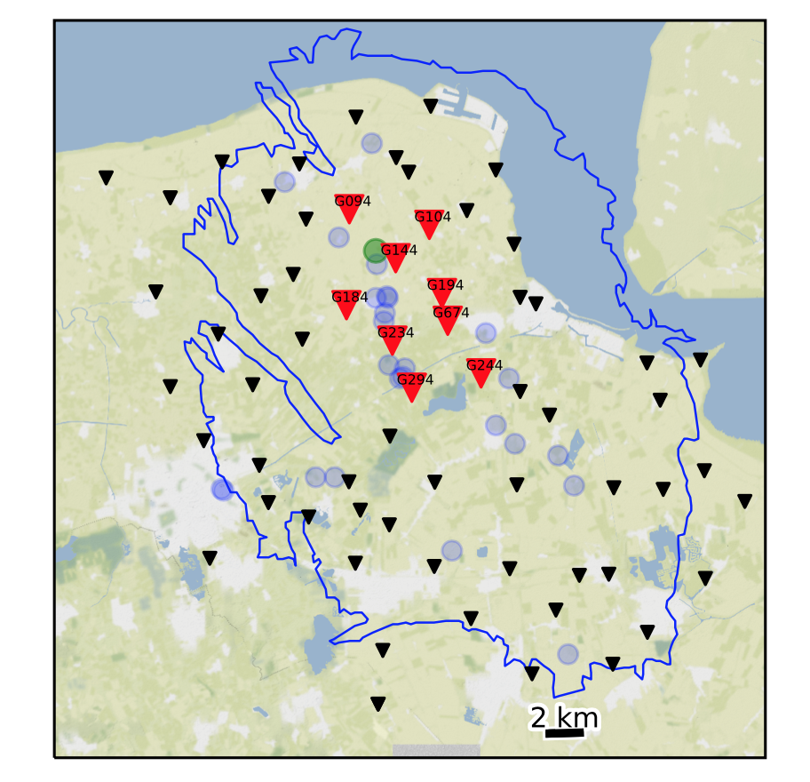
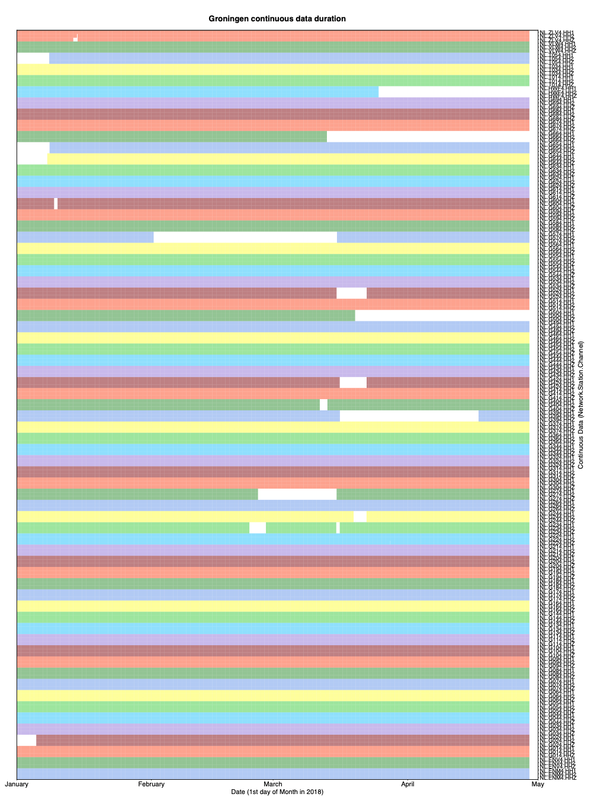
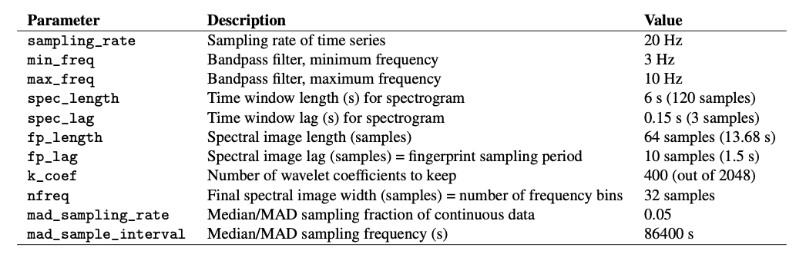
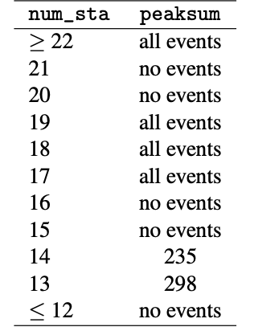

# Groningen Data Set  

* Location: Netherlands (gas production field)  
* Duration: 4 months (119 days): 2018-01-01 to 2018-04-30  
* Network: 67 stations (Figure 12), 3 components each (HH1, HH2, HHZ) = 201 channels. (Station G294 not used for detection due to short duration)  
* Sampling rate: 20 Hz (already downsampled)  
* Provided by: Zack Spica (Stanford Geophysics)  

  

<figcaption>Figure 12: Groningen map provided by Zack Spica: 67 stations (black, red triangles) used for FAST detection, and locations of known catalog events (blue circles).</figcaption>  

### 0.8.1 Preprocessing  

* Output continuous data duration: different stations used for detection have different durations and time gaps (need to modify paths in get_continuous_data_times.py):  

```
~/FAST/utils/preprocess/$ ../../parameters/preprocess/Groningen/continuous_data_times_Groningen.sh
```  

  

<figcaption>Figure 13: Duration of Groningen continuous data at 67 stations (change colors with each station), 3 components each. White sections indicate time gaps.</figcaption>  

The output files in continuous_duration/ can be read into a custom script called plot_continuous_
duration_Groningen.py to plot the duration of available continuous data at each station and channel (Figure 13).  

* Confirmed no zero-filled time-gap sections of continuous data in all 201 channels (need to modify paths in
fill_time_gaps_with_uncorrelated_noise.py):  

```
~/FAST/utils/preprocess/$ python fill_time_gaps_with_uncorrelated_noise.py
```  
**Use original mseed data files.**  

* Output sample spectrograms on each channel and station to determine bandpass filter range (need to modify
paths in plot_sample_spectrograms.py):  

```
~/FAST/utils/preprocess/$ ../../parameters/preprocess/Groningen/sample_spectrograms_Groningen.sh
```  

* Apply bandpass filter and decimate (need to modify paths in bandpass_filter_decimate.py):  

```
~/FAST/utils/preprocess/$ ../../parameters/preprocess/Groningen/bandpass_filter_decimate_Groningen.sh
```  

Based on sample spectrograms, filter 3-10 Hz for all 201 channels. No need to decimate, as sampling rate is already low at 20 Hz. Filtered continuous data files start with Deci1.bp3to10.*, which are input to the fingerprint step.  

### 0.8.2 Fingerprint  

Master script to create fingerprints on each channel, then generate global indices at the end:  

```
~/FAST/fingerprint/$ ../parameters/fingerprint/Groningen/run_fp_Groningen.sh
```  
**Example script to generate fingerprints on one channel (HHZ) at one station (G014), called by the master script run_fp_Groningen.sh:**  

```
~/FAST/fingerprint/$ python gen_fp.py ../parameters/fingerprint/Groningen/fp_input_NL_G014_HHZ.json
    "fingerprint": {
       "sampling_rate": 20,
       "min_freq": 3.0,
       "max_freq": 10.0,
       "spec_length": 6.0,
       "spec_lag": 0.12,
       "fp_length": 64,
       "fp_lag": 10,
       "k_coef": 400,
       "nfreq": 32,
       "mad_sampling_rate": 0.05,
       "mad_sample_interval": 86400
    "data": {
       "station": "G014",
       "channel": "HHZ",
       "start_time": "18-01-01T00:00:00.0",
       "end_time": "18-04-30T00:00:00.0",
       "folder": "/lfs/1/ceyoon/TimeSeries/Groningen/data/waveformsG014/",
```  

There are a total of 201 fp_input_NETWORK_STATION_CHANNEL.json fingerprint input files, one for each channel and station, all with the same input fingerprint parameters in Table S21.  

Table S21: Fingerprint input parameters for Groningen earthquake detection: 3-component at 67 stations (Figure 12, red, black triangles), after bandpass filter 3-10 Hz, and sampled at 20 Hz. The fingerprint sampling period is dt_fp = 1.5 seconds.  

  

Median/MAD output files: `mad/mad*.txt`  
Fingerprints (binary files): `fingerprints/G014.HHZ.fp`  
Timestamps at each fingerprint index (text files): `timestamps/G014.HHZ.ts`  

Finally, to create global indices for the Groningen data set, so that fingerprint indices from different channels (all 201) and stations are referenced to a common starting time:  

```
$ python global_index.py ../parameters/fingerprint/Groningen/global_indices_Groningen.json  
```  

The common starting time is in `global_idx_stats.txt`: 2018-01-01T00:00:04.500000 UTC 

### 0.8.3 Similarity Search  

Master script to run similarity search on each channel (out of 201 total):  

```
~/FAST/simsearch/$ ../parameters/simsearch/Groningen/run_simsearch_Groningen.sh
```  

Table S22: Similarity search input parameters for Groningen earthquake detection: 201 channels at 67 stations (3 components each).  

  

**Example script to run similarity search on one channel (HHZ) at one station (G014), called by the master script run_simsearch_Groningen.sh:**  

```
~/FAST/simsearch/$ ../parameters/simsearch/Groningen/filt_simsearch_input_Groningen.sh G014 HHZ
NTBLS=100
NHASH=5
NREPEAT=5
NVOTES=2
NTHREAD=56
NUM_PART=1
FREQ_NOISE=0.01
```  

Similarity search is run with the occurrence filter (FREQ_NOISE=0.01) for all 201 channels. A fingerprint that matches over 1% of other fingerprints is excluded from the similarity search, in order to avoid detecting noise that repeats often in time. The same input parameters are used for similarity search on all 201 channels (Table S22).  

### 0.8.4 Postprocessing  

**First**, run the master script to convert similarity search output from binary format to text format (3 columns: dt = idx1 − idx2, idx1, sim, sorted in increasing dt order) for each channel (201 total):  

```
~/FAST/postprocessing/$ ../parameters/postprocess/Groningen/output_Groningen_pairs.sh
```  

For example, on one channel (HHZ) at one station (G014), all on one line:  

```
~/FAST/postprocessing/$ python parse_results.py
-d /lfs/1/ceyoon/TimeSeries/Groningen/data/waveformsG014/fingerprints/
-p candidate_pairs_G014_HHZ -i /lfs/1/ceyoon/TimeSeries/Groningen/global_indices/G014_HHZ_idx_mapping.txt
```  

Output file for example (large size at channel level): `/lfs/1/ceyoon/TimeSeries/Groningen/data/waveformsG014/ fingerprints/candidate_pairs_G014_HHZ_merged.txt`  

**Second**, run the master script to combine similarity output from all 3 components at a given station, for all 67 stations:  

```
~/FAST/postprocessing/$ ../parameters/postprocess/Groningen/combine_Groningen_pairs.sh
```  

For example, on three channels (HH1, HH2, HHZ) at one station (G014), first move the similarity output text files to the inputs_network/ directory:  

```
$ cd /lfs/1/ceyoon/TimeSeries/Groningen/data/waveformsG014/fingerprints/
$ mv candidate_pairs_G014_HH*_merged.txt ../../../inputs_network/
```  

**Then** for each similar fingerprint pair, add the similarity from all 3 components at the same station, with a similarity threshold of 6 = (3 components)*(v=2 votes/component, Table S22). Note: this step will delete the candidate_ pairs_G014_HH*_merged.txt files.  

```
~/FAST/postprocessing/$ python parse_results.py
-d /lfs/1/ceyoon/TimeSeries/Groningen/inputs_network/
-p candidate_pairs_G014 --sort true --parse false -c true -t 6
```  

Output file for example (smaller size at station level):` /lfs/1/ceyoon/TimeSeries/Groningen/inputs_network/ candidate_pairs_G014_combined.txt`  

**Finally**, detect similar fingerprints across the network of 67 stations, using the input parameters in Table S23:  

```
~/FAST/postprocessing/$
python scr_run_network_det.py ../parameters/postprocess/Groningen/67sta_3stathresh_network_params.json
       "network": {
              "max_fp": 6798013,
              "dt_fp": 1.5, (seconds)
              "dgapL": 10, (15 s)
              "dgapW": 3, (4.5 s)
              "num_pass": 2,
            
28
},
```  

Table S23: Network detection input parameters for Groningen at 67 stations. max_fp = 6798013 is the largest fingerprint index over all channels from *mapping.txt files in the global_indices directory. dt_fp = 1.5 seconds is the fingerprint sampling period from Table S21.  

  

Network detection output file for example (smaller size at station level): `/lfs/1/ceyoon/TimeSeries/Groningen/ network_detection/67sta_3stathresh_detlist_rank_by_peaksum.txt (118,728 events) ` 

At this point, FAST earthquake detection processing is done.  

### 0.8.5 Remove duplicates after network detection  

The network detection output still contains many duplicate events, so we need to remove these using a few scripts, where you need to modify the hard-coded paths. (These are scripts I quickly came up with on the fly to help me analyze the detection output. Feel free to come up with improved scripts that would better suit your needs.)  

**First**, save only first and last time indices for each detection. For the last 2 columns: output the number of stations that detected event (num_sta) and difference between first and last index (diff_ind).  

```
~/FAST/utils/network/$ python arrange_network_detection_results.py
```  

==Output:== `NetworkDetectionTimes_67sta_3stathresh_detlist_rank_by_peaksum.txt` (118,728 events)  

**Second**, remove duplicate events. First remove events with exact first and last detection time indices. Then remove events with duplicate start times; for each start time, keep only the event with the highest num_sta (number of stations that detected the event) and peaksum (peak similarity).  

```
~/FAST/utils/network/$ ./remove_duplicates_after_network.sh
```  

==Output:== `uniquestart_sorted_no_duplicates.txt` (13,782 events)  

==Third==, remove events that overlap between the first and last detection time indices, keeping the event with the highest
num_sta and peaksum.  

```
~/FAST/utils/network/$ python delete_overlap_network_detections.py
```  

==Output:== `67sta_3stathresh_FinalUniqueNetworkDetectionTimes.txt` (6277 events)  

==Finally==, sort remaining events in descending order of num_sta, then peaksum, for the final detection list.  

```
~/FAST/utils/network/$ ./final_network_sort_nsta_peaksum.sh
```  

==Output:== `sort_nsta_peaksum_67sta_3stathresh_FinalUniqueNetworkDetectionTimes.txt` (6277 events)  

### 0.8.6 Visual inspection and final detections  

Plot event waveforms in the final detection list, ranked in descending order of num_sta, then peaksum, for visual inspection. Need to verify by looking at the waveforms that these are indeed earthquakes, and also enables setting final detection thresholds (Table 0.8.6).  

```
~/FAST/utils/events/$ python PARTIALplot_detected_waveforms_Groningen.py 0 6277
```  

==Output:== `.png` image files in `67sta_3stathresh_NetworkWaveformPlots/`  

Table S24: Final thresholds for Groningen applied to network detection parameters num_sta (number of stations that detected event pair) and peaksum (total similarity score at all stations) to determine list of earthquakes, set empirically after visual inspection. For each value of num_sta, a different threshold for peaksum can be applied.  

  

After visual inspection, 26 events are above thresholds in Table 0.8.6.  

  * `EQ_sort_nsta_peaksum_67sta_3stathresh_FinalUniqueNetworkDetectionTimes.txt`: 23 events that look like earthquake waveforms  
  * `FALSE_sort_nsta_peaksum_67sta_3stathresh_FinalUniqueNetworkDetectionTimes.txt`: 3 false detections above thresholds that do not look like earthquakes  

For the 23 earthquake events, output an event catalog:  

```
~/FAST/utils/events/$ python output_final_detection_list.py
```  

==Output:== `FINAL_Detection_List_Groningen_67sta_13stathresh.txt` (23 events)  
