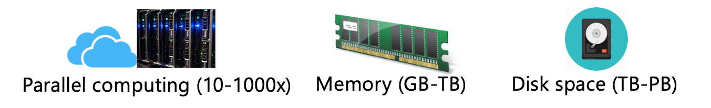

# FAST User Guide

Welcome to the <b>FAST</b> User Guide.

FAST is an end-to-end and unsupervised earthquake detection pipeline. It is a useful tool for seismologists to extract more small earthquakes from continuous seismic data.

<!-- 
## Commands

* `mkdocs new [dir-name]` - Create a new project.
* `mkdocs serve` - Start the live-reloading docs server.
* `mkdocs build` - Build the documentation site.
* `mkdocs -h` - Print help message and exit.

## Project layout

    mkdocs.yml    # The configuration file.
    docs/
        index.md  # The documentation homepage.
        ...       # Other markdown pages, images and other files. -->
