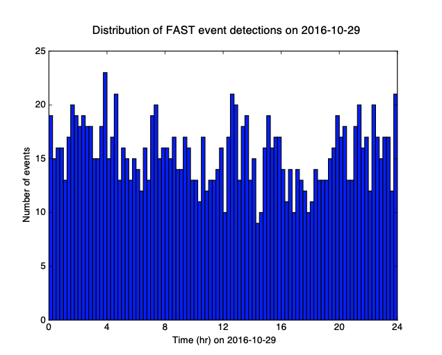

# 0.2 ItalyDayYR Data Set  

!!! info  
    One day of continuous data, 2016-10-29 00:00:00 to 2016-10-29 23:59:59 UTC, at 22 stations in central Italy (Figure 2), used 22 channels (vertical component HHZ only on each channel) for detection, provided by Bill Ellsworth. This data records small earthquakes from a swarm in Central Italy during October 2016, that occurred between the Mw 6.1 earthquake on 2016-10-26 19:18:08 UTC and the Mw 6.6 Norcia earthquake on 2016-10-30 06:40:18 UTC.  

  

<figcaption>Figure 2: Map of 22 stations (black triangles) in central Italy used for FAST detection of small earthquakes on 2016-10-29, one day of continuous data. The INGV catalog (http://cnt.rm.ingv.it/search) had 482 earthquakes (circles colored by depth, sized by relative magnitudes 0.4 ≤ M ≤ 4.1) inside the boundaries of this map on 2016-10-29.</figcaption>  

### 0.2.1 Preprocessing  

Output sample spectrograms on each channel and station to determine bandpass filter range:  

```
~/FAST/utils/preprocess/$ ../../parameters/preprocess/ItalyDayYR/sample_spectrograms_ItalyDayYR.sh
```  

Table S2: FAST input parameters for Italy earthquake detection: single-channel at 22 YR stations (Figure 2, black triangles), after bandpass filter 2-20 Hz, and decimate to 25 Hz. Total number of fingerprints: 71,989.  

  

Table S3: Network detection input parameters for Italy earthquakes at 22 YR stations (HHZ channel only), after getting similar pairs of fingerprints from FAST for each station.  

  

  

<figcaption>Figure 3: Distribution of FAST detections in central Italy continuous data on 2016-10-29. FAST detected a total of 1,485 earthquakes during this day.</figcaption>  