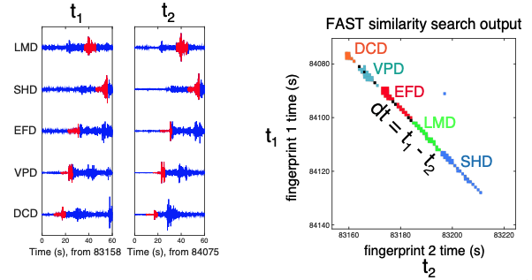
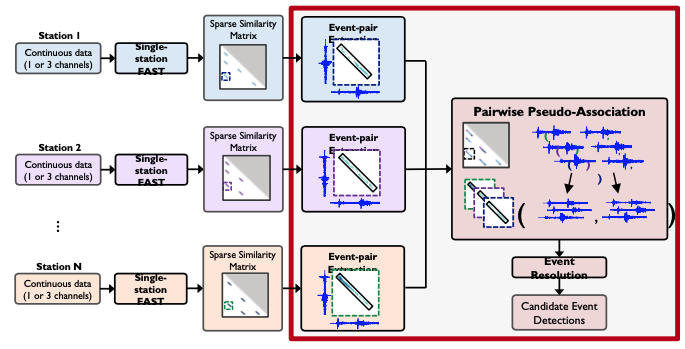
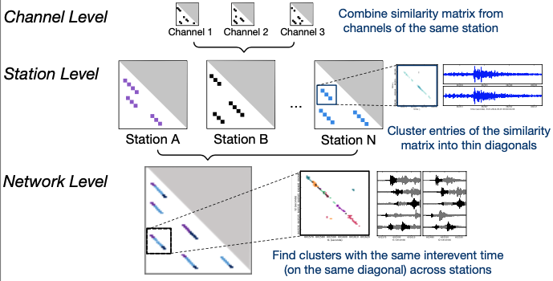
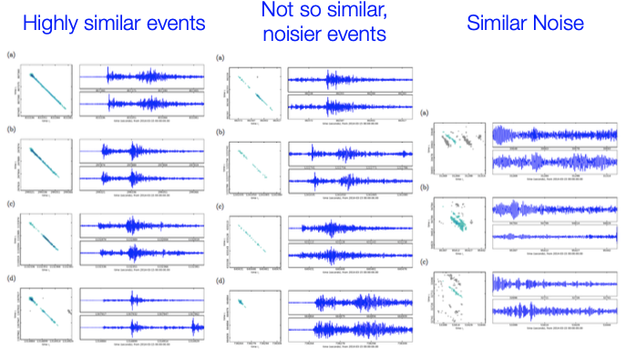
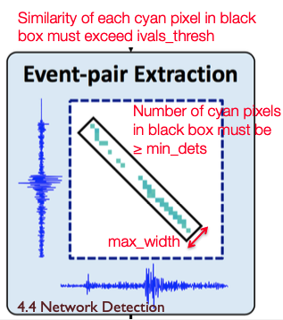
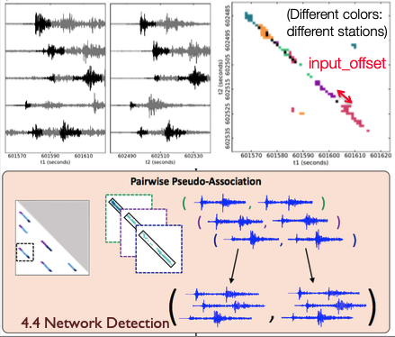
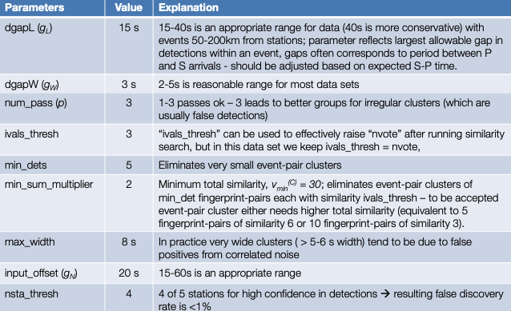

# **Network Detection** 

  

### Association: Detect Earthquakes Over a Seismic Network  

Earthquake pair at different stations: consistent inter-event time dt Reduce false detections  

  

### Network (Multi-Station) Detection with FAST  

  

### Network (Multi-Station) Illustration  

  

### Event-Pair Extraction Parameters  

```
    "network": {
        "dgapL": 3,                 # Longest allowed along-diagonal time gap (samples)  
        ”dgapW": 3,                 # Longest allowed cross-diagonal time gap (samples)  
        ”num_pass": 2,              # Adjacent diagonal merge iterations  
        ”ivals_thresh": 6,          # Minimum similarity (number of votes)  
        “min_dets": 4,              # Minimum number of fingerprint-pairs in a cluster  
        ”min_sum_multiplier": 1,    # Minimum total similarity multiplier for a cluster  
        "max_width": 8,             # Maximum bounding box width (samples)  
    }
```  

**Guidelines for setting parameters:**  

* ivals_thresh = nvote, **unless initial threshold is too low**. **Better approach is increasing** min_sum_multiplier (i.e. min_sum_multiplier = updated_nvote / nvote ) **which effectively increases fingerprint-pair threshold to** updated_nvote **with better thresholding that takes advantage of structure of event-pairs**  
* min_dets = 4-6  
* dgapL: **time interval equivalent to largest expected P-S gap (e.g. 10-20 seconds)**  
* dgapW: **should be small, equivalent to a few seconds (3-4 seconds)** 

```
    "network": {
        “max_fp": 74797,    # Max fingerprint index over all stations  
        ”dt_fp": 1.0,       # Fingerprint lag (s)  
        "dgapL": 3,         # Longest allowed along-diagonal time gap (samples)  
        ”dgapW": 3,         # Longest allowed cross-diagonal time gap (samples)  
        ”num_pass": 2,      # Adjacent diagonal merge iterations
    },
```  

  

<figcaption>Event-Pair Extraction Parameters (1 Station)</figcaption>  

* `dgapL`, `dgapW`: determine whether to keep as 1 cluster or split into 2 clusters  
    * Multiply `dgapL`, `dgapW` by dt_fp to get values in seconds

* `num_pass`=2 is good default (3 is also ok, but takes longer)  

### Event-Pair Extraction Samples  

  

```
    "network": {
        ”ivals_thresh": 6,              # Minimum similarity (number of votes)  
        “min_dets": 4,                  # Minimum number of fingerprint-pairs in a cluster  
        ”min_sum_multiplier": 1,        # Minimum total similarity multiplier for a cluster  
        "max_width": 8,                 # Maximum bounding box width (samples)  
    },
```  

  

<figcaption>Event-Pair Pruning Parameters (1 Station)</figcaption>  

* Set higher thresholds on similarity in order to identify an event-pair cluster Minimum total similarity threshold: `ivals_thresh` * `min_dets` * `min_sum_multiplier`  
* `max_width`: 8 is a good default value, probably don’t need to change  
    * multiply by dt_fp to get value in seconds  

### Network Detection Performance Parameter Guidance

```
    "performance": {
        "partition_size": 2147483648,  
        "num_cores": 4  
    }
```  

* `partition_size`: Maximum size of each partition (bytes), if entire list of similarity search output pairs does not fit into memory
* `num_cores`: Number of threads for parallel processing (event-pair extraction only)  

  

### Pseudo-Association Parameters (Multiple stations)  

```
    ”network": { 
        ”nsta_thresh": 2,       # Minimum number of stations for detection  
        “input_offset": 3,      # Arrival time constraint: maximum time gap (samples)
    },
```

  

* Set `nsta_thresh` low to begin, can increase threshold later  
* n`sta_thresh`=1: single station detection not yet thoroughly tested  
* Set `input_offset` to be largest expected time gap between S wave at 1 station and P wave at another station
    * Multiply by dt_fp to get value in seconds  

* `input_offset`: arrival time constraint: maximum time gap (samples)  
    * `input_offset` is the longest time period that can elapse with no active detections (for a given – event-pair): after a gap of more than `input_offset` samples within a network event-pair, pseudo- association will automatically create a new network event-pair.
    * A reasonable upper-bound on `input_offset` is the largest expected S-P time for any station in the network, or the largest difference in P arrival times between any pair of stations in the network, whichever is larger. Usually, `input_offset` can be shorter than this upper-bound, but the value should not be smaller than the time gap parameter used in event-pair extraction: `input_offset` > `dgapL`.
    * Note that because all event-pairs are only grouped together into network event-pairs only if they have nearly identical inter-event times, there is limited risk of falsely associating event-pairs or of being unable to resolve overlapping events (with detections separated by a time interval of less than `input_offset`) due to selecting the value of `input_offset` that is somewhat longer than necessary. However, `input_offset` should not be set to a value that is unnecessarily large (e.g. 60+ seconds) because this does increase the chance of spurious associations of unrelated event-pairs observed at different stations in the network.
    * **For most data sets, the value of network time gap parameter should lie within the range, `input_offset` = 15-40 seconds**

### Event Resolution Implementation  

* Event resolution is applied separately to each station using detections from each station that meet network detection threshold (e.g. observed at minimum number of station)  
* In this implementation, event resolution method is relatively simple to minimize memory usage for large data sets. Specifically event resolution does not keep information about structure of pairwise detections, only whether there was a detection (in any event-pair) for each time stamp.  
* Thus in this version of the code, events that are overlapping in time at a single station with be resolved to a single event. In order to tease out two separate events that overlap in time at a single station, the user will need to go back to the network detection output from pairwise pseudo-association. Two events overlapping in time at a single station will belong to different network event-pairs (if there are two detections at the same station in the same network event-pair, then these are not overlapping events, but different phases of the same event).  

### Event Resolution Implementation Algorithm: 


### Sample Parameter Settings: 2014 M8.2 Iquique Foreshock Sequence  

(from Bergen & Beroza, 2018)  

