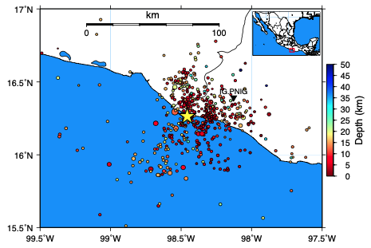
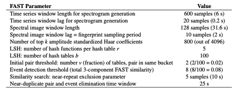
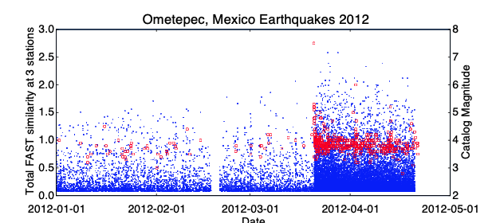

# Ometepec, Mexico, January - April 2012  

  

<figcaption>Figure 9: Map of 1 station in southern Mexico (black triangle) used for FAST detection of small earthquakes from 2012-01-01 to 2012-04-21. The SSN catalog (http://www2.ssn.unam.mx:8080/catalogo/) had 558 earthquakes (circles colored by depth, sized by relative magnitudes 2.8 ≤ M ≤ 7.5) inside the boundaries of this map during the detection time period. The yellow star denotes the location of the Mw 7.5 Ometepec earthquake on 2012-03-20.</figcaption>  

!!! info
    The objective of this study is to identify repeating earthquake sequences as tools to measure deep aseismic slip rates [Dominguez et al., 2016], and characterize the unusually active aftershock sequence of the Mw 7.5 Omepetec, Mexico earthquake on 2012-03-20 [UNAM, 2013] (Figure 9). 112 days of continuous data (2012-01-01 to 2012-04-21) at 1 station, 3 components, provided by Luis Dominguez of Universidad Nacional Autonoma de Mexico (UNAM)-Morelia. For all 3 channels, I applied a 3-20 Hz bandpass filter, and kept the original sampling rate of 100 Hz.  

FAST detected a total of 31,970 earthquakes during these 4 months. 30,923 were earthquakes (Figure 10), and 1,047 were noise, as determined by visual inspection. ***NOTE: postprocessing and elimination of duplicate detection pairs was done with the old MATLAB code from [Yoon et al., 2015] and [Yoon et al., 2017]. Single-station event-pair extraction with network FAST was not yet available. These were the events I sent to Luis, who performed single-station location using P-wave polarization analysis (Figure 10).  

Table S17: FAST input parameters for Ometepec, Mexico earthquake detection, applied to each component at station IG.PNIG. For the median statistics calculation (for wavelet coefficient selection), we randomly sampled 10% of the data, once per day. Total number of fingerprints (largest number over all channels): 4,795,140.  

  

  

<figcaption>Figure 10: Ometepec, Mexico earthquake detections from 2012-01-01 to 2012-04-21. The blue dots indicate the total 3-component FAST similarity (left y-axis) of the 30,923 FAST detections as a function of time. The red dots indicate the magnitudes (right y-axis) of the 558 catalog events as a function of time. Following the Mw 7.5 earthquake on 2012-03-20, aftershocks are abundant.</figcaption>  