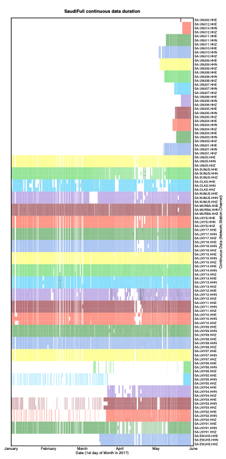
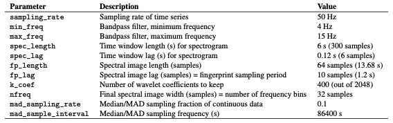
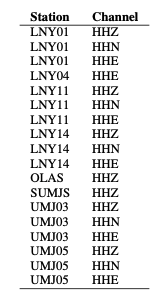
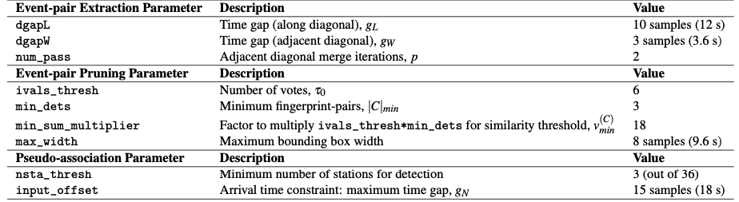
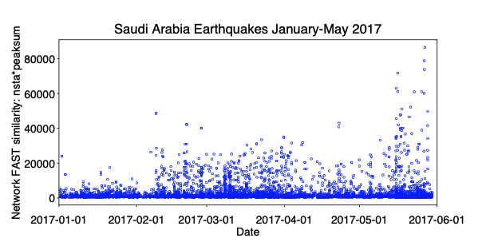

# 0.5 SaudiFull Data Set: Saudi Arabia, January - May 2017  

* Location: Saudi Arabia, January - May 2017 (volcanic area with dikes)  
* Duration: up to 5 months (151 days): 2017-01-01 to 2017-05-30  
* Network: 36 stations, 3 components each (HHE, HHN, HHZ) = 106 channels. (Station SA.UMJ02: only HHE channel)  
* Sampling rate: 100 Hz  
* Provided by: Mohammad Youssof (KAUST)  

### 0.5.1 Preprocessing  

* Output continuous data duration: different stations used for detection have different durations and time gaps (need to modify paths in get_continuous_data_times.py):  

```
~/FAST/utils/preprocess/$ ../../parameters/preprocess/SaudiFull/continuous_data_times_SaudiFull.sh
```  

The output files in `continuous_duration/` can be read into a custom script called `plot_continuous_ duration_SaudiFull.py` to plot the duration of available continuous data at each station and channel (Figure 7).  

  

<figcaption>Figure 7: Duration of SaudiFull continuous data at 36 stations (change colors with each station), 3 components each (except SA.UMJ02 which has only HHE). White sections indicate time gaps.</figcaption>

* Detected zero-filled time-gap sections of continuous data in all 106 channels (need to modify paths in fill_ time_gaps_with_uncorrelated_noise.py), and filled them with random uncorrelated noise:  

```
~/FAST/utils/preprocess/$ python fill_time_gaps_with_uncorrelated_noise.py  
```  

Only stations SA.UMJ03, SA.UMJ05, SA.UMJ08 had zero-filled time-gap sections, which were filled with random noise and saved as files starting with the `Filled.*` string. The majority of continuous data files had no zero-filled time gaps, so we used original mseed data files.  

* Output sample spectrograms on each channel and station to determine bandpass filter range (need to modify paths in plot_sample_spectrograms.py):  

```
~/FAST/utils/preprocess/$ ../../parameters/preprocess/SaudiFull/sample_spectrograms_SaudiFull.sh
```  

* Apply bandpass filter and decimate (need to modify paths in bandpass_filter_decimate.py):  

```
~/FAST/utils/preprocess/$ ../../parameters/preprocess/SaudiFull/bandpass_filter_decimate_SaudiFull.sh
```  

Based on sample spectrograms, apply a station-specific bandpass filter (Table S11). Decimate by a factor of 2 to a sampling rate of 50 Hz. Filtered continuous data files start with `Deci2.bpXtoY.*`, where X is the lower frequency and Y is the higher frequency, which are input to the fingerprint step.  

Table S11: Preprocessing parameters for SaudiFull earthquake detection, for each station (same filter applied to all components), 5 months continuous data (2017-01-01 to 2017-05-31), at 36 stations, decimate to 50 Hz.  

  

### 0.5.2 Fingerprint  

Master script to create fingerprints on each channel, then generate global indices at the end:  

```
~/FAST/fingerprint/$ ../parameters/fingerprint/SaudiFull/run_fp_SaudiFull.sh
```  

Example script to generate fingerprints on one channel (HHZ) at one station (LNY03), called by the master script run_fp_SaudiFull.sh:  

```
~/FAST/fingerprint/$ python gen_fp.py ../parameters/fingerprint/SaudiFull/fp_input_SA_LNY03_HHZ.json
    "fingerprint": {
       "sampling_rate": 50,
       "min_freq": 4.0,
       "max_freq": 15.0,
       "spec_length": 6.0,
       "spec_lag": 0.12,
       "fp_length": 64,
       "fp_lag": 10,
       "k_coef": 400,
       "nfreq": 32,
       "mad_sampling_rate": 0.1,
       "mad_sample_interval": 86400
    "data": {
       "station": "LNY03",
       "channel": "HHZ",
       "start_time": "17-01-01T00:00:00.0",
       "end_time": "17-05-31T00:00:00.0",
       "folder": "/lfs/1/ceyoon/TimeSeries/SaudiFull/SA.LNY03/",
```  

There are a total of 106 fp_input_NETWORK_STATION_CHANNEL.json fingerprint input files, one for each channel and station, all with the same input fingerprint parameters in Table S12.  

Median/MAD output files: `mad/mad*.txt`  

Table S12: Fingerprint input parameters for SaudiFull earthquake detection: 3-component at 36 stations (except for SA.UMJ02), after applying station-specific bandpass filter (Table S11), and sampled at 50 Hz. The fingerprint sampling period is dt_fp = 1.2 seconds.  

  

Fingerprints (binary files): `fingerprints/LNY03.HHZ.fp`  
Timestamps at each fingerprint index (text files): `timestamps/LNY03.HHZ.ts`  

Finally, to create global indices for the SaudiFull data set, so that fingerprint indices from different channels (all 106) and stations are referenced to a common starting time:  

```
$ python global_index.py ../parameters/fingerprint/SaudiFull/global_indices_SaudiFull.json  
```  

The common starting time is in `global_idx_stats.txt`: 2017-01-01T00:00:06.840000 UTC  

### 0.5.3 Similarity Search  

Master script to run similarity search on each channel (out of 106 total):  

```
~/FAST/simsearch/$ ../parameters/simsearch/SaudiFull/run_simsearch_SaudiFull.sh  
```  

Table S13: Similarity search input parameters for SaudiFull earthquake detection: 106 channels at 36 stations (3 components each, except SA.UMJ02). The occurrence filter, specified by the FREQ_NOISE parameter, was applied only for selected stations and channels (Table S14).  

  

Example script to run similarity search on one channel (HHZ) at one station (LNY03), called by the master script `run_simsearch_SaudiFull.sh`:  

```
~/FAST/simsearch/$ ../parameters/simsearch/SaudiFull/simsearch_input_SaudiFull.sh LNY03 HHZ
NTBLS=100
NHASH=4
NREPEAT=5
NVOTES=2
NTHREAD=56
NUM_PART=1
```  

We first ran similarity search with the same input parameters on all 106 channels, without the occurrence filter. For 18 selected channels (Table S14), where the `candidate_pairs` similarity search outputs were especially large because of correlated noise, we ran similarity search with the occurrence filter (FREQ_NOISE=0.01), which significantly reduced the similarity search output file sizes. A fingerprint that matches over 1% of other fingerprints is excluded from the similarity search, in order to avoid detecting noise that repeats often in time. For example, the occurrence filter was applied for station LNY01 channel HHZ by calling the script `filt_simsearch_input_SaudiFull.sh` from the master script `run_simsearch_SaudiFull.sh`:  

```

~/FAST/simsearch/$ ../parameters/simsearch/SaudiFull/filt_simsearch_input_SaudiFull.sh LNY03 HHZ
NTBLS=100
NHASH=4
NREPEAT=5
NVOTES=2
NTHREAD=56
NUM_PART=1
FREQ_NOISE=0.01
```  

Table S14: Selected stations and channels from SaudiFull data set where we applied the occurrence filter with FREQ_ NOISE=0.01.  

  

### 0.5.4 Postprocessing  

**First**, run the master script to convert similarity search output from binary format to text format (3 columns: dt = idx1 − idx2, idx1, sim, sorted in increasing dt order) for each channel (106 total):  

```
~/FAST/postprocessing/$ ../parameters/postprocess/SaudiFull/output_SaudiFull_pairs.sh
```  

For example, on one channel (HHZ) at one station (LNY03), all on one line:  

```
~/FAST/postprocessing/$ python parse_results.py
-d /lfs/1/ceyoon/TimeSeries/SaudiFull/SA.LNY03/fingerprints/
-p candidate_pairs_LNY03_HHZ -i /lfs/1/ceyoon/TimeSeries/SaudiFull/global_indices/LNY03_HHZ_idx_mapping.txt
```  

==Output file for example (large size at channel level):== `/lfs/1/ceyoon/TimeSeries/SaudiFull/SA.LNY03/fingerprints/candidate_pairs_LNY03_HHZ_merged.txt`  

**Second**, run the master script to combine similarity output from all 3 components at a given station, for all 36 stations:  

```
~/FAST/postprocessing/$ ../parameters/postprocess/SaudiFull/combine_SaudiFull_pairs.sh  
```  

!!! example
    For example, on three channels (HHE, HHN, HHZ) at one station (LNY03), first move the similarity output text files to the inputs_network/ directory:  

```
$ cd /lfs/1/ceyoon/TimeSeries/SaudiFull/SA.LNY03/fingerprints/
$ mv candidate_pairs_LNY03_HH*_merged.txt ../../../inputs_network/
```  

**Then** for each similar fingerprint pair, add the similarity from all 3 components at the same station, with a similarity threshold of 6 = (3 components)*(v=2 votes/component, Table S13). Note: this step will delete the c`andidate_ pairs_LNY03_HH*_merged.txt` files.  

```
~/FAST/postprocessing/$ python parse_results.py
-d /lfs/1/ceyoon/TimeSeries/SaudiFull/inputs_network/
-p candidate_pairs_LNY03 --sort true --parse false -c true -t 6
```  

==Output file for example (smaller size at station level):== `/lfs/1/ceyoon/TimeSeries/SaudiFull/inputs_network/ candidate_pairs_LNY03_combined.txt`  

For station SA.UMJ02, which has only 1 component (HHE), multiply the similarity sim by 3 to give this station an equal weight as the other 3-component stations:  

```
~/FAST/postprocessing/$ awk ’{print $1, $2, 3*$3}’
/lfs/1/ceyoon/TimeSeries/SaudiFull/SA.UMJ02/fingerprints/candidate_pairs_UMJ02_HHE_merged.txt
> /lfs/1/ceyoon/TimeSeries/SaudiFull/SA.UMJ02/fingerprints/candidate_pairs_UMJ02_combined.txt
```  

**Finally**, detect similar fingerprints across the network of 36 stations, using the input parameters in Table S15:  

```
~/FAST/postprocessing/$
python scr_run_network_det.py ../parameters/postprocess/SaudiFull/36sta_3stathresh_network_params.json
       "network": {
              "max_fp": 10736786,
              "dt_fp": 1.2, (seconds)
              "dgapL": 10, (12 s)
              "dgapW": 3, (3.6 s)
              "num_pass": 2,
              "min_dets": 3,
              "min_sum_multiplier": 1,
              "max_width": 8, (9.6 s)
              "ivals_thresh": 6,
              "nsta_thresh": 3,
              "input_offset": 15 (18 s)
},
```  

Network detection output file for example (smaller size at station level): `/lfs/1/ceyoon/TimeSeries/SaudiFull/ network_detection/36sta_3stathresh_detlist_rank_by_peaksum.txt` (21,498 events)  

At this point, FAST earthquake detection processing is **done**.  

Table S15: Network detection input parameters for SaudiFull at 36 stations. max_fp = 10736786 is the largest fingerprint index over all channels from *mapping.txt files in the global_indices directory. dt_fp = 1.2 seconds is the fingerprint sampling period from Table S12.  

  

### 0.5.5 Remove Duplicates After Network Detection  

!!! info 
    The network detection output still contains many duplicate events, so we need to remove these using a few scripts, where you need to modify the hard-coded paths. (These are scripts I quickly came up with on the fly to help me analyze the detection output. Feel free to come up with improved scripts that would better suit your needs.)  

**First**, save only first and last time indices for each detection. For the last 2 columns: output the number of stations that detected event (num_sta) and difference between first and last index (diff_ind).  

```
~/FAST/utils/network/$ python arrange_network_detection_results.py
```  

==Output:== `NetworkDetectionTimes_36sta_3stathresh_detlist_rank_by_peaksum.txt (21,498 events)`  

**Second**, remove duplicate events. First remove events with exact first and last detection time indices. Then remove events with duplicate start times; for each start time, keep only the event with the highest num_sta (number of stations that detected the event) and peaksum (peak similarity).  

```
~/FAST/utils/network/$ ./remove_duplicates_after_network.sh  
```  

==Output:== `uniquestart_sorted_no_duplicates.txt (15,054 events)`  

**Third**, remove events that overlap between the first and last detection time indices, keeping the event with the highest
num_sta and peaksum.  

```
~/FAST/utils/network/$ python delete_overlap_network_detections.py  
``` 

==Output:== `36sta_3stathresh_FinalUniqueNetworkDetectionTimes.txt` (11,597 events)  

**Fourth**, since different channels in the network have different durations (for example, in Figure 7, stations UMJ01-UMJ12 were active only during May 2017, while many of the other stations were active from January to May 2017), we calculate a normalized measure of the number of stations that detected the event: frac_ch, which is the fraction of channels that were active at each detection time. This is done by reading in files that were generated during preprocessing by get_continuous_data_times.py. This normalization step would not be necessary if all stations and channels in the network recorded the same duration of data.  

```
~/FAST/utils/network/$ python get_station_count_detections.py
```  

==Output:== `36sta_3stathresh_ChannelCount_FinalUniqueNetworkDetectionTimes.txt` (11,597 events)  

**Finally**, sort remaining events in descending order of num_sta, then frac_ch, then peaksum, for the final detection
list.  

```
~/FAST/utils/network/$ ./final_network_sort_nsta_fracch_peaksum.sh
```  

==Output:== `sort_nsta_peaksum_36sta_3stathresh_ChannelCount_FinalUniqueNetworkDetectionTimes.txt` (11,597 events)  

### 0.5.6 Visual Inspection and Final Detections  

Plot event waveforms in the final detection list, ranked in descending order of num_sta, then peaksum, for visual inspection. Need to verify by looking at the waveforms that these are indeed earthquakes, and also enables setting final detection thresholds (Table S16).  

```
~/FAST/utils/events/$ python PARTIALplot_detected_waveforms_SaudiFull.py 0 11597
```  

==Output:== `.png` image files in `36sta_3stathresh_NetworkWaveformPlots/`  

Table S16: Final thresholds for SaudiFull applied to network detection parameters num_sta (number of stations that detected event pair) and peaksum (total similarity score at all stations) to determine list of earthquakes, set empirically after visual inspection. For each value of num_sta, a different threshold for peaksum can be applied.  

  

After visual inspection, 4634 events are above thresholds in Table S16.  

* `EQ_sort_nsta_peaksum_36sta_3stathresh_ChannelCount_FinalUniqueNetworkDetectionTimes.txt`: 4543 events that look like earthquake waveforms  
* `FALSE_sort_nsta_peaksum_36sta_3stathresh_ChannelCount_FinalUniqueNetworkDetectionTimes.txt`: 91 false detections above thresholds that do not look like earthquakes  

For the 4543 earthquake events, output an event catalog (Figure 8):  

```
~/FAST/utils/events/$ python output_final_detection_list.py
```  

==Output:== `FINAL_Detection_List_SaudiFull_36sta_3stathresh.txt` (4543 events)  

  

<figcaption>Figure 8: Saudi Arabia earthquake detections from 2017-01-01 to 2017-05-31. The vertical axis indicates a measure of network FAST similarity: nsta*peaksum (Table S16). FAST detected a total of 4,543 earthquakes during this month.</figcaption>  