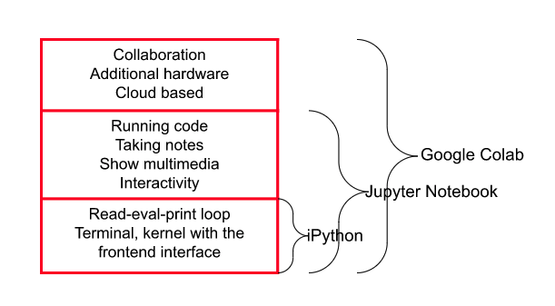

# **Installation for Google Colab**

!!! info 
    If you are new to FAST, testing out FAST in Google Colab is a great way to get an overview of the software and learn how to test your own data.  

## What is Colab?

[Colab](https://www.tutorialspoint.com/google_colab/index.htm) is a free Jupyter notebook environment that runs entirely in the cloud. It lets you and your team members edit documents the way you work with Google Docs and also run code on a data set and visualize the results. Colab supports many popular machine learning libraries which can be easily loaded in your notebook.

<figcaption>The relationship between iPython, Jupyter Notebook, and Google Colab. ()</figcaption>

## Run FAST in Colab

To run FAST in Google Colab, copy [this](https://colab.research.google.com/drive/1Xfe4Icx44WwM8kDkdJDJNgKCrNP3U5rz?usp=sharing) Google Colab FAST example using data from the Hector Mine into your Google drive.

The Colab uses a small example data set from the Hector Mine with 7 stations and less than one day long. With the Hector Mine data set, you can run the end-to-end FAST pipeline, from fingerprint to output list of detection times, in just a few minutes, since it is a small data set.

If you want to learn how to use FAST as a beginner, using the Hector Mine example data set is suggested since a bigger data set might take hours, which is not useful.

Use the instructions in the [How to Set Parameters](input_and_preprocess.md) section to prepare and test your own data set.
