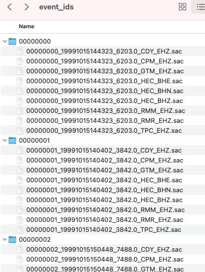
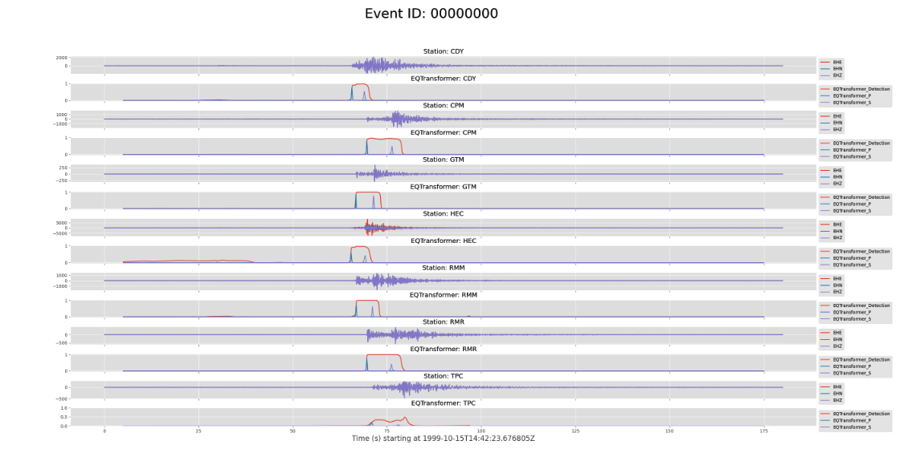
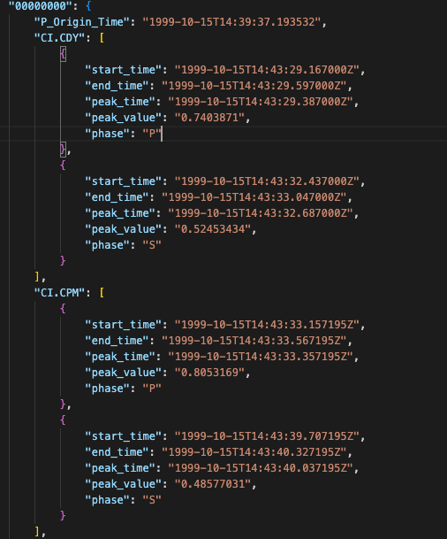
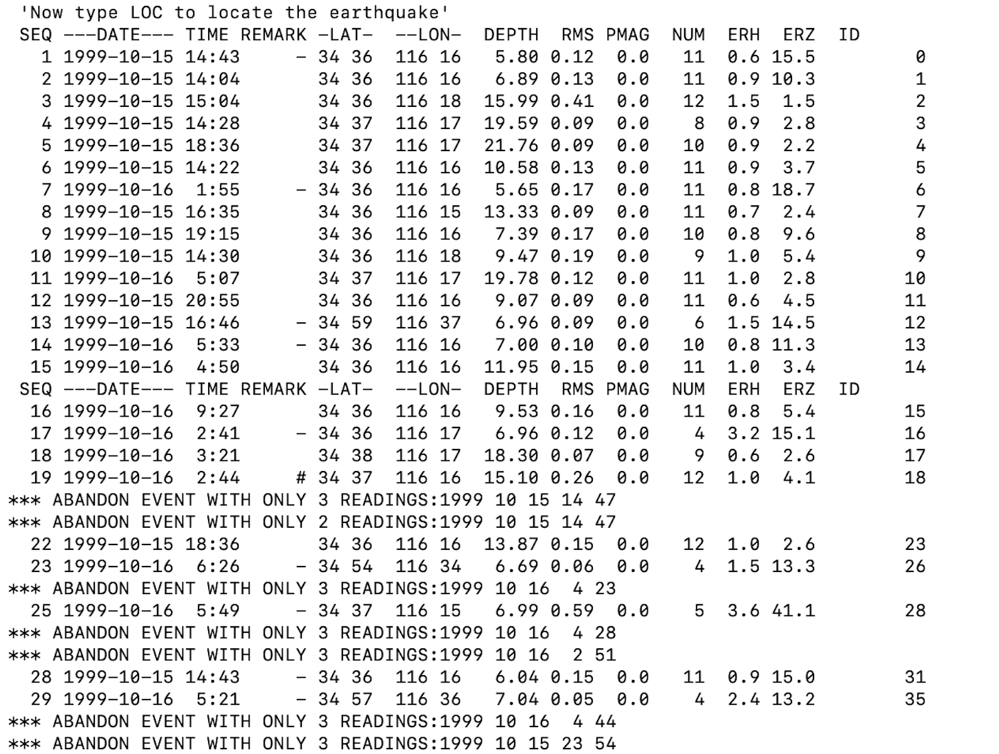
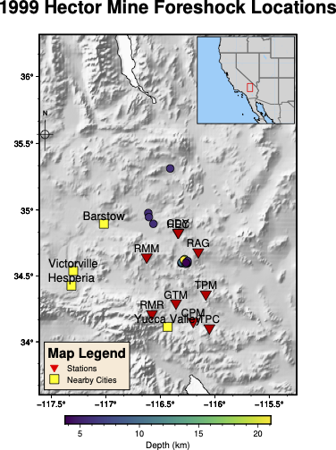

# **Installation for Docker**

[Docker](https://www.docker.com/) is an open-source project for automating the deployment of applications as portable, self-sufficient containers that can run on the cloud or on-premises. ([Source](https://docs.microsoft.com/en-us/dotnet/architecture/microservices/container-docker-introduction/docker-defined))

Docker lets you run FAST on a non-Linux operating system, so it is recommended for Mac or Windows users.

## **Install Docker**
Install Docker on your machine [here](https://www.docker.com/products/docker-desktop/). To get started, make sure Docker has been successfully installed by running:

``` bash
$ docker run hello-world
```

You should see the `Hello from Docker!` message displayed. Otherwise, refer to Docker's documentation for getting started [here](https://www.docker.com/get-started/).

!!! warning
    By default, Docker for Mac allocates **2.00GB of RAM**. The more memory available on Docker, the faster FAST will run. Please refer to [**Docker's Docker Desktop for Mac user manual**](https://docs.docker.com/desktop/mac/#resources) for more information on how to increase the allocated memory.

## **Setting up Docker for FAST**

 Create a directory for FAST code and outputs

``` 
$ mkdir DockerFAST
```  

Change permissions so that Docker can write to this directory

```
$ chmod 777 DockerFAST
```

Clone the FAST repository from GitHub

```
$ cd DockerFAST
$ git clone https://github.com/stanford-futuredata/FAST
```

Build the Docker image

!!! note
    Building the Docker image with Dockerfile with set up all FAST dependencies (Linux Ubuntu 18.04, CMake compiler, C++ boost, conda for python virtual environment and libraries).

```
$ cd FAST
$ docker build -f Dockerfile -t fast_image:0.1 .
```

* `-f` - Name of the Dockerfile
* `-t` - Tag name

Run the Docker image in a Docker container

```
$ docker run -v ${PWD}:/app -it fast_image:0.1 /bin/bash
```

* `-v` - Bind mount a volume. The current directory in ${PWD} is mounted inside the container into the directory /app, so that any changes to files made inside the container are saved to disk and persist after exiting the container.
* `-it` - Short for --interactive + --tty, which takes you inside the container in interactive mode, allowing you to run commands on the command line in the container, which we need to run FAST.

Now we are in the Docker container, in the `eq_fast` conda environment. We are ready to run FAST now.
```
(eq_fast) root@555d364b63d7:/app/FAST#
```

## **Running FAST with Docker**

### Generate fingerprints for the data set

```
(eq_fast) root@555d364b63d7:/app/FAST# python run_fp.py -c config.json
```

### Search for Similar Earthquakes

```
(eq_fast) root@555d364b63d7:/app/FAST# cd simsearch/
(eq_fast) root@555d364b63d7:/app/FAST/simsearch# cmake .
(eq_fast) root@555d364b63d7:/app/FAST/simsearch# make
(eq_fast) root@555d364b63d7:/app/FAST/simsearch# cd ..
(eq_fast) root@555d364b63d7:/app/FAST# python run_simsearch.py -c config.json
```

### Parse FAST Similarity Search Output

```
(eq_fast) root@555d364b63d7:/app/FAST# cd postprocessing/
(eq_fast) root@555d364b63d7:/app/FAST/postprocessing# ../parameters/postprocess/output_HectorMine_pairs.sh
(eq_fast) root@555d364b63d7:/app/FAST/postprocessing# ../parameters/postprocess/combine_HectorMine_pairs.sh
(eq_fast) root@555d364b63d7:/app/FAST/postprocessing# python scr_run_network_det.py ../parameters/postprocess/7sta_2stathresh_network_params.json
```

### Postprocess: Network Detection

```
(eq_fast) root@555d364b63d7:/app/FAST/postprocessing# cd ../utils/network/
(eq_fast) root@555d364b63d7:/app/FAST/utils/network# python arrange_network_detection_results.py
(eq_fast) root@555d364b63d7:/app/FAST/utils/network# ./remove_duplicates_after_network.sh
(eq_fast) root@555d364b63d7:/app/FAST/utils/network# python delete_overlap_network_detections.py
(eq_fast) root@555d364b63d7:/app/FAST/utils/network# ./final_network_sort_nsta_peaksum.sh
```

### Visualize the FAST Output

```
(eq_fast) root@555d364b63d7:/app/FAST/utils/network# cat ../../data/network_detection/sort_nsta_peaksum_7sta_2stathresh_FinalUniqueNetworkDetectionTimes.txt
```

### Display Waveforms for FAST Detections in Descending Order of "Peaksum" Similarity

This example outputs png images for 100 event waveforms with the highest "Peaksum" similarity.

```
(eq_fast) root@555d364b63d7:/app/FAST/utils/network# cd ..
(eq_fast) root@555d364b63d7:/app/FAST/utils# cd events/
(eq_fast) root@555d364b63d7:/app/FAST/utils/events# python PARTIALplot_detected_waveforms_HectorMine.py 0 100
```

!!! note
    View images outside Docker container — to manually determine detection threshold
    ```
    $ ls ../../data/network_detection/7sta_2stathresh_NetworkWaveformPlots/
    event_rank00000_nsta7_peaksum1015_ind6204_time6204.0_1999-10-15T14:43:24.676000.png
    event_rank00001_nsta7_peaksum1015_ind3842_time3842.0_1999-10-15T14:04:02.676000.png
    event_rank00002_nsta7_peaksum920_ind7488_time7488.0_1999-10-15T15:04:48.676000.png
    event_rank00003_nsta7_peaksum823_ind5286_time5286.0_1999-10-15T14:28:06.676000.png
    event_rank00004_nsta7_peaksum718_ind20202_time20202.0_1999-10-15T18:36:42.676000.png
    event_rank00005_nsta7_peaksum713_ind46536_time46536.0_1999-10-16T01:55:36.676000.png
    ...
    ```

### Set Detection Threshold

!!! note
    Everything above the detection threshold is deemed an earthquake. In this example, the first 50 events with the highest "Peaksum" similarity are identified as earthquakes, while the remaining events are not earthquakes.

```
(eq_fast) root@555d364b63d7:/app/FAST/utils/events# cd ../../data/network_detection/
(eq_fast) root@555d364b63d7:/app/FAST/data/network_detection# head -50 sort_nsta_peaksum_7sta_2stathresh_FinalUniqueNetworkDetectionTimes.txt > EQ_sort_nsta_peaksum_7sta_2stathresh_FinalUniqueNetworkDetectionTimes.txt
```

### Output Final FAST Detected Event List

```
(eq_fast) root@555d364b63d7:/app/FAST/data/network_detection# cd ../../utils/events/
(eq_fast) root@555d364b63d7:/app/FAST/utils/events# python output_final_detection_list.py
(eq_fast) root@555d364b63d7:/app/FAST/utils/events# cat ../../data/network_detection/FINAL_Detection_List_HectorMine_7sta_2stathresh.txt
```

<br></br>

!!! info
    The following tutorials are not a part of FAST but are optional steps to take for phase picking and earthquake location using SeisBench, HYPOINVERSE, and PyGMT.

## **Phase Picking**  

### Cut SAC Files  

* Cut the continuous seismic data at all stations, based on the detection results from FAST
In this example, the event waveform time windows are 180 seconds long, 60 seconds before detection time, 120 seconds after detection time.

```
(eq_fast) root@555d364b63d7:/app/FAST/utils/events# python cut_event_files.py
```  

* Check for cut files in:  

```
(eq_fast) root@555d364b63d7:/app/FAST/data/event_ids#
```

* Example:  



### Install SeisBench  

```
(eq_fast) root@555d364b63d7:/app/FAST/utils/events# cd ../..
(eq_fast) root@555d364b63d7:/app/FAST# pip install seisbench
```

### Pick Phases (automatically)  

* Run SeisBench script for all events and all stations. This can take a few minutes to finish running.

```
(eq_fast) root@555d364b63d7:/app/FAST# cd utils/picking
(eq_fast) root@555d364b63d7:/app/FAST/utils/picking# python run_seisbench.py
```  

* Annotated plots are found in:  

```
(eq_fast) root@555d364b63d7:/app/FAST/data/seisbench_picks
```  


* Example annotated plot from event 00000000:  



Output saved in:

```
(eq_fast) root@555d364b63d7:/app/FAST/data/seisbench_picks/event_picks.json
```  
Example output:  



* "peak_time": Arrival time of pick
* "peak_value": Probability of pick

## **Earthquake Location**  

The output from `run_seisbench.py` in the `event_picks.json` file contains the information needed to locate the detected earthquakes from the FAST final detection list. We use HYPOINVERSE to locate earthquakes from the picks found with `run_seisbench.py`.  

HYPOINVERSE is the standard location program supplied with the Earthworm seismic acquisition and processing system (AQMS). Read more about it [here](https://www.usgs.gov/software/hypoinverse-earthquake-location).  

### Formatting input data for HYPOINVERSE

To begin earthquake location run the following to format the phase picks for HYPOINVERSE:  

```
(eq_fast) root@555d364b63d7:/app/FAST/utils/picking# cd ../location/
(eq_fast) root@555d364b63d7:/app/FAST/utils/location# python SeisBench2hypoinverse.py
```

Output:
```
/app/FAST/data/location_hypoinverse/EQT_19991015_test.txt
```

Get Hector Mine Station List as a json file:
```
(eq_fast) root@555d364b63d7:/app/FAST/utils/location# cd ../preprocess/
(eq_fast) root@555d364b63d7:/app/FAST/utils/preprocess # python get_station_list.py
```

Output:
```
/app/FAST/data/stations/station_list.json
```

Convert `station_list.json` to HYPOINVERSE station input format in `station_list.sta`:
```
(eq_fast) root@555d364b63d7:/app/FAST/utils/preprocess# cd ../location/
(eq_fast) root@555d364b63d7:/app/FAST/utils/location# python output_station_file.py
```

Output:
```
/app/FAST/data/location_hypoinverse/station_list.sta
```

### Install and Run HYPOINVERSE

Check that GFortran is installed, since it is required to compile the HYPOINVERSE program from source:

```
(eq_fast) root@555d364b63d7:/app/FAST# gfortran --version
```  

Example expected output:  
==GNU Fortran (Ubuntu 7.5.0-3ubuntu1~18.04) 7.5.0==  

If GFortran is not installed, run:  
```
(eq_fast) root@555d364b63d7:/app/FAST# apt-get update && apt-get upgrade
(eq_fast) root@555d364b63d7:/app/FAST# apt-get install gfortran
```

Download HYPOINVERSE [here](https://www.usgs.gov/software/hypoinverse-earthquake-location), expand the `hyp1.40.tar` file,
move the resulting `hyp1.40/` directory to `/app/FAST/utils/location/hyp1.40/`. This can be done with the following commands:
```
(eq_fast) root@555d364b63d7:/app/FAST/utils/location# wget -c https://escweb.wr.usgs.gov/content/software/HYPOINVERSE/hyp1.40.tar
(eq_fast) root@555d364b63d7:/app/FAST/utils/location# mkdir hyp1.40
(eq_fast) root@555d364b63d7:/app/FAST/utils/location# cd hyp1.40
(eq_fast) root@555d364b63d7:/app/FAST/utils/location/hyp1.40# tar -xvf ../hyp1.40.tar
(eq_fast) root@555d364b63d7:/app/FAST/utils/location/hyp1.40# ls -l
drwxr-xr-x  4 10003  124   128 Sep 10  2014 doc
-rw-r--r--  1 root  root 77392 Sep 10  2014 hyp1.40-release-notes.pdf
-rw-r--r--  1 root  root  3258 Sep 10  2014 hyp1.40-release-notes.txt
drwxr-xr-x 54 10003  124  1728 Sep 10  2014 source
drwxr-xr-x 13 10003  124   416 Aug 26  2014 testone
```

Before compiling HYPOINVERSE, we need to make changes to `makefile` in `/app/FAST/utils/location/hyp1.40/source/`:
```
(eq_fast) root@555d364b63d7:/app/FAST/utils/location/hyp1.40# cd source
(eq_fast) root@555d364b63d7:/app/FAST/utils/location/hyp1.40/source# sed -i '/calnet/d' makefile
(eq_fast) root@555d364b63d7:/app/FAST/utils/location/hyp1.40/source# sed -i 's/g77/gfortran/g' makefile
```

* Remove lines **16** and **230**

```  py linenums="16"
cp hyp1.40 /home/calnet/klein/bin
```  

```  py linenums="230"
cp p2sdly /home/calnet/klein/bin
```  

* Find and replace: `g77` with `gfortran`

**Check that HYPOINVERSE runs**:

* Compile hypoinverse:
```
(eq_fast) root@555d364b63d7:/app/FAST/utils/location/hyp1.40/source# make
```  

* Make it executable, if it isn't already:
```
(eq_fast) root@555d364b63d7:/app/FAST/utils/location/hyp1.40/source# chmod +x hyp1.40
```  

* Run HYPOINVERSE:
```
(eq_fast) root@555d364b63d7:/app/FAST/utils/location/hyp1.40/source# ./hyp1.40
```  

* Expected output:
```
HYPOINVERSE 2000 STARTING
6/2014 VERSION 1.40 (geoid depth possible)
 COMMAND?
```   

If you have this output, HYPOINVERSE is running correctly. Press ctrl-c to exit.

### Run HYPOINVERSE

Copy the following files from `/app/FAST/utils/location/` to the directory `/app/FAST/data/location_hypoinverse/` where we will run HYPOINVERSE:
```
   *   hadley.crh
   *   locate_events.hyp
```
To run HYPOINVERSE:  
```
(eq_fast) root@555d364b63d7:/app/FAST/utils/location# cd ../../data/location_hypoinverse/
(eq_fast) root@555d364b63d7:/app/FAST/data/location_hypoinverse/# ../../utils/location/hyp1.40/source/hyp1.40
```  

Use **@locate_events.hyp** as input:
```
HYPOINVERSE 2000 STARTING
6/2014 VERSION 1.40 (geoid depth possible)
 COMMAND? @locate_events.hyp
```  

Expected output:
   

You should see output files called `locate_events.sum` and `locate_events.arc` in HYPOINVERSE Y2000 summary format, but these are difficult to read.

!!! note
    `locate_events.arc` has the event info, and phase pick info for each event. `locate_events.sum` has only the event info, no phase pick info.

Use `output_hypoinverse_as_text.py` to output `locate_events.sum` in a more readable format to use for plotting and visualization.

```
(eq_fast) root@555d364b63d7:/app/FAST/data/location_hypoinverse/# cd ../../utils/location/
(eq_fast) root@555d364b63d7:/app/FAST/utils/location# python output_hypoinverse_as_text.py
```

## **Plotting Earthquake Locations with PyGMT**

### Install PyGMT

IMPORTANT - PyGMT needs to be installed and run in a separate `pygmt` conda environment, since it is incompatible with the `eq_fast` conda environment.

First, exit the `eq_fast` conda environment
```
(eq_fast) root@555d364b63d7:/app/FAST/utils/location# conda deactivate
```

Next, create the `pygmt` conda environment with its dependencies, as described in the [PyGMT install page](https://www.pygmt.org/latest/install.html)
```
root@555d364b63d7:/app/FAST/utils/location# conda config --prepend channels conda-forge
root@555d364b63d7:/app/FAST/utils/location# conda create --name pygmt python=3.9 numpy pandas xarray netcdf4 packaging gmt
```

Finally, enter the `pygmt` conda environment and install PyGMT
```
root@555d364b63d7:/app/FAST/utils/location# conda activate pygmt
(pygmt) root@555d364b63d7:/app/FAST/utils/location# conda install pygmt
```  

### Create a PyGMT map of earthquake locations and seismic stations

```
(pygmt) root@555d364b63d7:/app/FAST/utils/location# cd ../mapping/
(pygmt) root@555d364b63d7:/app/FAST/utils/mapping# python hypoinverse_to_pygmt.py
```  

Figure saved as `pygmt_hectormine_map.png` in `/app/FAST/data/mapping_pygmt/`

**Map Output**:  



## **Exiting the Docker Container**

```
(pygmt) root@555d364b63d7:/app/FAST/utils/mapping# exit
exit
```

After exiting the Docker container, all files created within the container should still be accessible on your disk
since the current directory was mounted inside the container with `docker run -v ${PWD}:/app`.

## **View status of the Docker Container**
```
$ docker ps -a
CONTAINER ID   IMAGE                             COMMAND                  CREATED        STATUS                      PORTS     NAMES
555d364b63d7   fast_image:0.1                    "/bin/bash"              6 days ago     Exited (1) 25 seconds ago             pensive_ramanujan
```

## **Enter Docker Container again**

We can pick up where we left off after entering the same Docker container again. Notice that the `pygmt` conda environment is still there.
```
$ docker start -i 555d364b63d7
(eq_fast) root@555d364b63d7:/# cd app
(eq_fast) root@555d364b63d7:/app# ls
Calipatria      FAST_userguide_v0.pdf  __pycache__                      changes                 data             fingerprint  parse_config.py   run_fp.py         utils
Calipatria.zip  LICENSE                calipatria_client.ipynb          config.json             docs             mkdocs.yml   postprocessing    run_simsearch.py
Dockerfile      README.md              calipatria_massdownloader.ipynb  config_calipatria.json  environment.yml  parameters   requirements.txt  simsearch
(eq_fast) root@6006660926e5:/app# conda env list
# conda environments:
#
base                     /root/miniconda3
eq_fast               *  /root/miniconda3/envs/eq_fast
pygmt                    /root/miniconda3/envs/pygmt
```

## **Remove all Docker Containers and Images**

WARNING: ONLY DO THIS WHEN YOU WANT TO REMOVE ALL DOCKER CONTAINERS AND IMAGES!!!

This step will free up lots of space on your computer.

```
$ docker system prune
WARNING! This will remove:
- all stopped containers
- all networks not used by at least one container
- all dangling images
- all dangling build cache
```

