# **Similarity Search**  

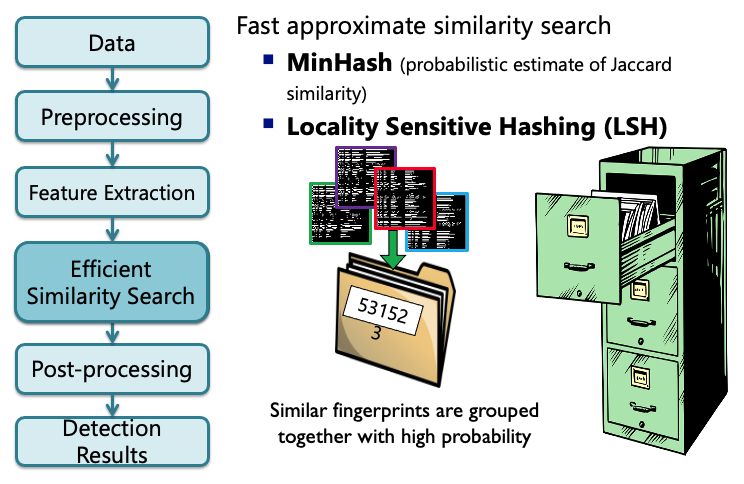  

## Hashing  

### Min-Hash*

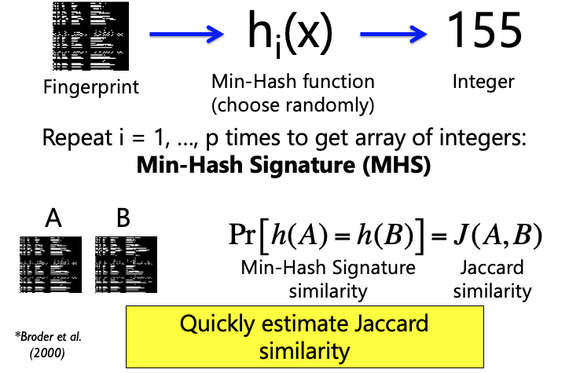

### **Example:** Min-Hash Signature (MHS)  


### LSH* Example: Constructing Database

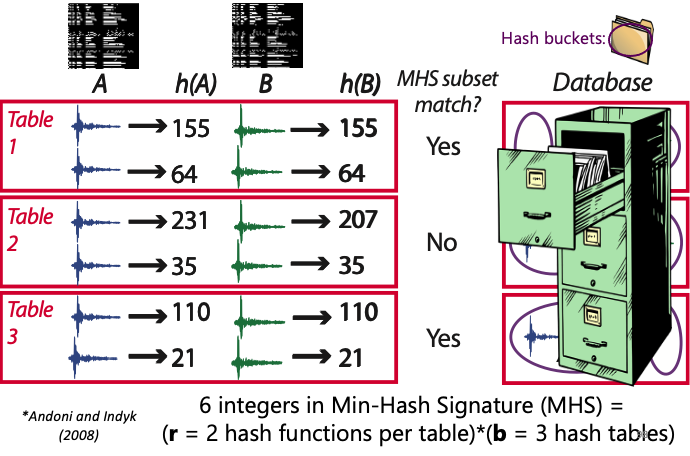

### Similarity Search in Fingerprint Database

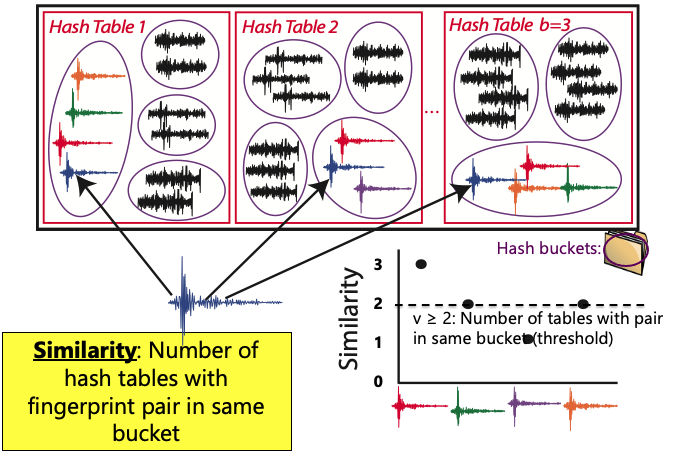

### Probability of Detection  

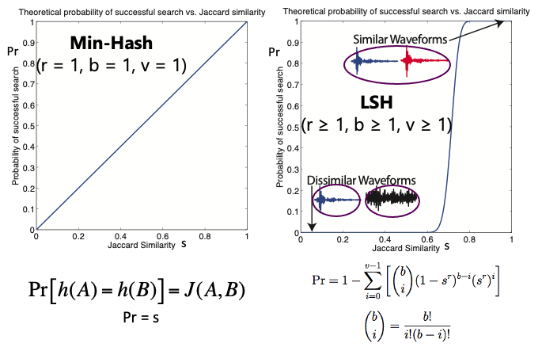  

```
"lsh_param": {
    "ntbl": 100,        # b: Number of hash tables  
    "nhash": 4,         # r: Number of hash functions per table  
    "nvote": 2,         # v: Number of votes  
    "nthread": 8,       # Number of threads for parallel processing  
    "npart": 1,         # Number of partitions for the database  
    "repeat": 5         # Near-repeat exclusion parameter (samples)  
},
```

  

<figcaption> Jaccard Similarity</figcaption>  

### LSH Parameter Guidance  

* `ntbl` (b): Number of hash tables
    * **100** is good default value

* `nhash` (r): Number of hash functions per table  
    * ^^Most sensitive parameter; significant effect on detection performance^^  
    * **Lower values:** fewer missed detections, more false detections, longer runtime  
    * **Higher values:** more missed detections, fewer false detections, shorter runtime  
    * Suggested values (only possibilities are 1,2,3,4,5,6,7,8):  
        * `nhash`=4 for shorter duration data sets (days – weeks)  
        * `nhash`=5 for longer data sets (months – year)  
        * `nhash`=6 for longest data sets (5-10 years)  

* `nvote` (v): Number of votes (pair of similar fingerprints must be in same hash bucket in at least v out of b hash tables)  
    * Can use `nvote` as threshold for single station detection  
    * `nvote`=2 is good starting value; initially set low, can increase threshold later during network detection  

* `repeat`: Near-repeat exclusion parameter  
    * Avoid detecting any fingerprint with itself (or slight offset to itself), which is guaranteed to be similar  
    * 5 samples is good default value (Multiply by `dt_fp` to get value in seconds)  

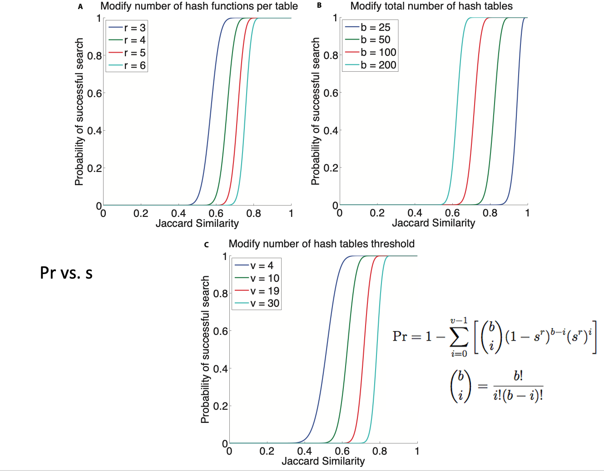

<figcaption>The Jaccard similarity threshold (fast increasing part of the S-curve) increases with the increase of number of hash functions (r), number of votes (v) and the decrease of number of tables (b)</figcaption>  

### Performance Impact of LSH Parameters

  

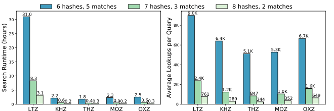  

### Performance Impact of LSH Parameters (Explanation)  

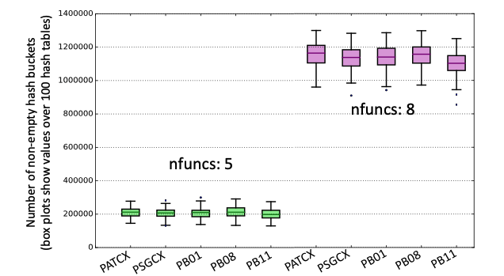  

<figcaption>Larger nfuncs --> more non-empty hash buckets</figcaption>  

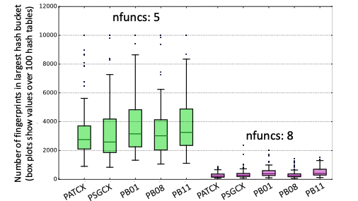  

<figcaption>Larger “nfuncs” --> more non-empty hash buckets, but “largest” hash buckets are smaller (i.e. fingerprints are more “spread out” within hash table) --> faster runtime for similarity search but lower detection threshold (fingerprints must have higher Jaccard similarity for hash collisions).</figcaption>  

### LSH parameters and Detection Results  

The **sensitivity** of the FAST detector depends on the combination of ==nfuncs== and ==nvotes==. The table below shows how the number of detections identified by multi-station FAST on the Iquique foreshock data set from Bergen & Beroza (2018a) changes as the nfuncs and nvotes parameters are varied. The first row (highlighted in blue) gives the parameter values used in Bergen & Beroza (2018a).  

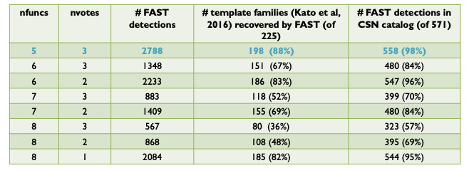  

The size of the output (# of fingerprint-pairs, i.e. # non-zeros in sparse similarity matrix) of the FAST detector depends on the combination of ==nfuncs== and ==nvotes==.  

Increasing nvotes decreases the output size by increasing the detection threshold, while increasing nfuncs decreases the output size by lowering the detection threshold. Even though the number of detections for (nfuncs 5, nvotes 3) is slightly larger than for (nfuncs 8, nvotes 1), the latter has an output size that is an order of magnitude larger – this is due to a higher chance of spurious hash collisions associated with requiring only a single “vote” or collision out of 100 hash tables. Table shows output size for FAST detection results in Iquique case study from Bergen & Beroza (2018a).  

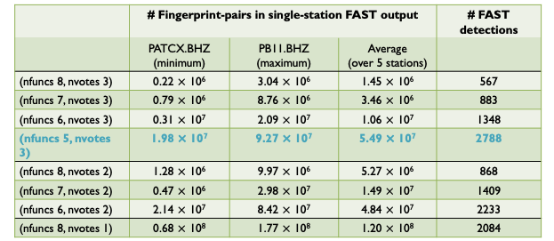 

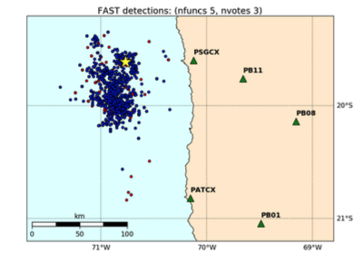  

<figcaption>Locations of FAST detections in Kato et al (2016) template matching catalog or in local seismicity catalog (CSN) for detection with LSH parameter values: <b>nfuncs: 5</b>, <b>nvotes: 3</b></figcaption>

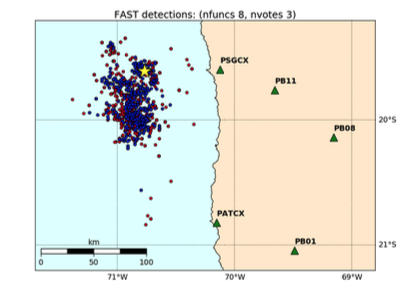  

<figcaption>Locations of FAST detections in Kato et al (2016) template matching catalog or in local seismicity catalog (CSN) for detection with LSH parameter values: <b>nfuncs: 8</b>, <b>nvotes: 3</b></figcaption>  

  

<figcaption>Locations of FAST detections in Kato et al (2016) template matching catalog or in local seismicity catalog (CSN) for detection with LSH parameter values: <b>nfuncs: 8</b>, <b>nvotes: 1</b></figcaption>  

### LSH Parameter Guidance (Performance related)  

* `ncores`: Number of processes for parallel processing    
    * For large continuous data sets (>months): use as many as your machine allows  
    * Runtime decreases inverse proportionally with the increase of number of threads  

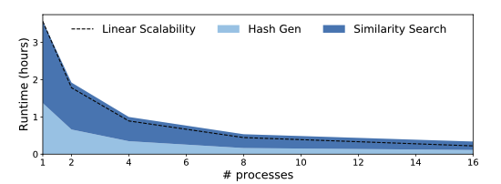  

* `num_partitions`: Number of partitions for LSH database  
    * LSH database can be enormous, especially for large continuous data sets  
    * FAST is intended to run on Linux clusters with lots of memory (> 64 GB); figure out how much memory is on your machine  
        * If data set is small (days-weeks), use `num_partitions`= 1 (entire database fit in memory)
        * Use num_partitions > 1 for larger data sets, so that each partition fits in memory  

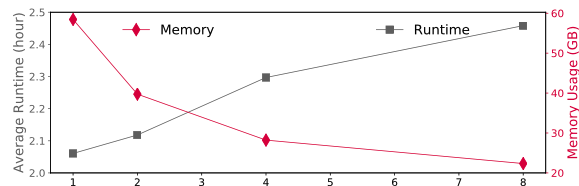

<figcaption># partitions</figcaption>  

* `noise_freq`: (==Occurrence filter==) Frequency threshold above which fingerprints will be filtered out as correlated noise  
    * Consider turning on this filter if some of the stations/channels produce orders of magnitude more outputs or take significant longer than its counterparts  
    * The slow down might be caused by the large number of matches generated from persistent background noise (see figure below as an example)  

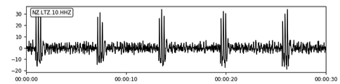  

<figcaption>Example of correlated noise</figcaption>  

* Increase `num_partitions` to capture correlated noise that only appear in short segments of the input data  

* **Example parameters**
    * Input: 1 year of time series data
        * `noise_freq`=0.01  
        * `num_partitions`=12  
        * Filter out fingerprints that matches over ==1%== of other fingerprints in the current partition (partition length = 1 year / 12 = ==1 month==)  
    * Input: 1 month of time series data  
        * `noise_freq`=0.005  
        * `num_partitions`=30  
        * Filter out fingerprints that matches over ==0.5%== of other fingerprints in the current partition (partition length = 1 month / 30 = ==1 day==)  

* Performance benefits  
    * Can reduce the similarity search output size by orders of magnitude as well as improve runtime  
    * Reduced output size further improves the postprocessing runtime  

### FAST Similarity Search Output Format  

* Naming convention for text output files  
    * One file, regardless of npart: `candidate_pairs_${STATION}_${CHANNEL}_merged.txt`  
    * **Example text file (output):** `candidate_pairs_CDY_EHZ_merged.txt`  

* Content of output file:  
    * list of pairs of similar fingerprints and their similarity, sorted in increasing dt order: ==dt = index1-index2==, ==index1==, ==sim==  
    * ==index1== is index of first fingerprint (according to global index)  
    * ==index2== is index of second fingerprint (according to global index)  
    * ==sim== is “FAST similarity”: Number of hash tables (out of b=ntbl) containing fingerprints index1 and index2 in same bucket; should be ≥ (v=nvote). Note: not normalized as the fraction divided by b.  

* To get fingerprint times  
    * get global start time ==t0== from global_idx_stats.txt, fingerprint lag ==dt_fp== in seconds  
    * ==time1== = t0 + dt_fp * index1, ==time2== = t0 + dt_fp * index2