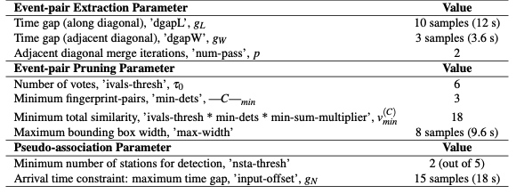
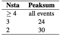
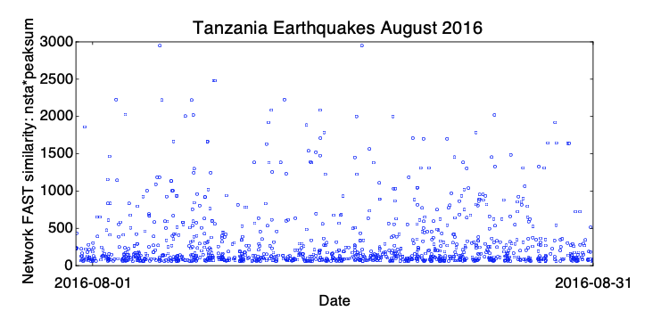

# 0.3 Tanzania, August 2016  

Temporary dense deployment of seismic stations in Tanzania to identify previously unknown faults and infer their dimensions. 1 month continuous data (2016-07-31 to 2016-08-31), at 5 stations, 15 channels (3 components per station), provided by Laura Parisi of King Abdullah University of Science and Technology (KAUST). The stations are located about 10 km apart, at the base of a volcanic caldera called Ngorongoro Crater. For all 15 channels, we applied the following preprocessing: 4-12 Hz bandpass filter, then decimated to 25 Hz (factor of 8, from original 200 Hz); also, all time gaps with 0’s were filled with uncorrelated random noise (only on station CES04).  

Table S4: FAST input parameters for Tanzania earthquake detection, applied to each component at all 5 stations. For the median statistics calculation (for wavelet coefficient selection), we randomly sampled 10% of the data, once per day. Total number of fingerprints (largest number over all channels): 2,231,989.  

  

Table S5: Network detection input parameters for Tanzania earthquakes at 5 stations, after getting similar pairs of fingerprints from FAST for each station — added similarity from all 3 [HNE,HNN,HNZ] components at a given station and set station-pair threshold of (v=2)*(3 components) = 6.  

  

Table S6: Final thresholds for Tanzania earthquakes, applied to network detection parameters *nsta* (number of stations that detected event pair) and *peaksum* (total similarity score at all stations) to determine list of earthquakes, set empirically after visual inspection. For each value of *nsta*, a different threshold for *peaksum* can be applied.  

  

  

<figcaption>Figure 4: Tanzania earthquake detections from 2016-07-31 to 2016-08-31. The vertical axis indicates a measure of network FAST similarity: nsta*peaksum (Table S6). FAST detected a total of 1,156 earthquakes during this month. Some false positive detections had to be removed manually, especially detections on only 2 out of 5 stations.</figcaption>  
