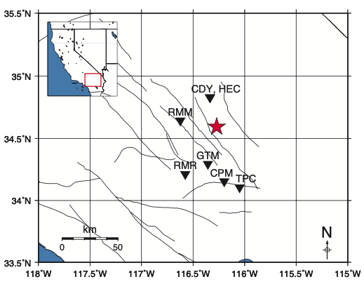
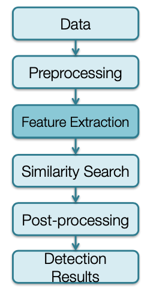
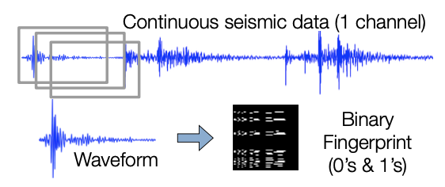
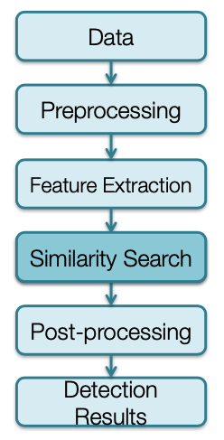
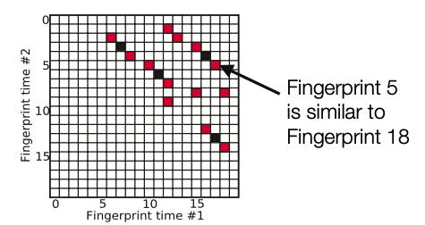

# **Tutorial**

## **Example Data: Hector Mine Foreshocks**



<br></br>

* 20 hours of continuous data from 7 stations (9 components). <br>
* The data is already bandpass filtered, decimated to 20 Hz. HEC is 3-components; other stations are 1-component.

<br></br>

<p align="center">waveform data: <span style="color: red;">data/waveforms${STATION}/Deci5*</span></p>

## **File Structure Overview**

### *Code*  

    fingerprint/          # Fingerprint
    simsearch/            # Similarity Search
    postprocessing/       # Postprocessing
    utils/                # Utility Functions
        preprocess/       
        network/          
        events/           
        run_fp.py         
        run_simsearch.py  


### *Configuration and Parameters*  

    parameters/            
        fingerprint/       
        simsearch/         
        postprocess/       

### *Data*  

    data/
        waveforms${STATION}/
            Deci5*

## **Feature Extraction**  



### *Input*  

&nbsp;&nbsp;&nbsp;&nbsp;&nbsp;&nbsp;continuous seismic data from a channel

### *Output*  

&nbsp;&nbsp;&nbsp;&nbsp;&nbsp;&nbsp;a binary fingerprint for each overlapping segment of the original &nbsp;&nbsp;&nbsp;&nbsp;&nbsp;waveform

### *Key Property*  

&nbsp;&nbsp;&nbsp;&nbsp;&nbsp;&nbsp;similarity of the binary fingerprints approximates that of the &nbsp;&nbsp;&nbsp;&nbsp;&nbsp;original waveforms  



### **Generate Fingerprints**

* Create fingerprints for each of the 9 channels (7 stations) + global index, using wrapper
  
``` bash
~/quake_tutorial$ python run_fp.py -c config.json
```

* Alternatively, to fingerprint a specific station, call the fingerprint script with the corresponding fingerprint parameter file:

``` bash
~/quake_tutorial$ cd fingerprint/
~/quake_tutorial/fingerprint$ python gen_fp.py ../parameters/fingerprint/fp_input_CI_CDY_EHZ.json
```

### **Global Index**

!!! note
    Global index is already called by run_fp.py wrapper  

* Complete this step only ^^after^^ you have finished computing ^^fingerprints^^ for ^^every^^ component and station you want to use for detection.  
  
``` bash
$ python global_index.py global indices.json
```

  - `global_index.py` **in** `fingerprint/`
  - `global_indices.json` **in** `parameters/fingerprint/`  
<br>
* Continuous data start/end times may be different, and time gaps may happen at different times, at different components and stations.  
* Global index: consistent way to refer to times of fingerprints at different components and stations.  

## **Similarity Search**



### *Input*  

&nbsp;&nbsp;&nbsp;&nbsp;&nbsp;&nbsp;binary fingerprints from one seismic channel

### *Output*  

&nbsp;&nbsp;&nbsp;&nbsp;&nbsp;&nbsp;all pairs of binary fingerprints whose (Jaccard) similarity is above the &nbsp;&nbsp;&nbsp;&nbsp;&nbsp;&nbsp;threshold  

### *Efficient approximate similarity search*  

&nbsp;&nbsp;&nbsp;&nbsp;&nbsp;&nbsp;MinHash (probabilistic estimate of Jaccard similarity)  
&nbsp;&nbsp;&nbsp;&nbsp;&nbsp;&nbsp;Locality Sensitive Hashing (LSH)  



### **Search for Similar Earthquake Pairs**

* Compile and build C++ similarity search code.

``` bash
~/quake_tutorial$ cd simsearch/
~/quake_tutorial$ cmake .
~/quake_tutorial$ make
```  

* Similarity search for each of the 9 channels (7 stations), using wrapper  

``` bash
~/quake_tutorial/simsearch$ cd ..
~/quake_tutorial$ python run_simsearch.py -c config.json
```  

* Alternatively, to use similarity search for a specific station, call the similarity search script with the corresponding similarity search parameter file:

``` bash
~/quake_tutorial$ cd simsearch/
~/quake_tutorial$ cp ../parameters/simsearch/simsearch_input_HectorMine.sh .
~/quake_tutorial$ ./simsearch_input_HectorMine.sh
```

### FAST Similarity Search Output (1 Channel)  

• <span style="color: red;"> data/waveforms${STATION}/fingerprints</span>  
&nbsp;&nbsp;&nbsp;&nbsp;&nbsp;&nbsp; — MinHash Signatures (can delete these later)  
&nbsp;&nbsp;&nbsp;&nbsp;&nbsp;&nbsp;&nbsp;&nbsp;&nbsp;&nbsp;&nbsp;&nbsp;• <span style="color: red;">mh_${STATION}_${CHANNEL}_${nhash}.bin</span>  
&nbsp;&nbsp;&nbsp;&nbsp;&nbsp;&nbsp;&nbsp;&nbsp;&nbsp;&nbsp;&nbsp;&nbsp;• <span style="color: red;">Example: mh_CDY_EHZ_4.bin</span>  

&nbsp;&nbsp;&nbsp;&nbsp;&nbsp;&nbsp; — Binary files with similarity search output (npart files, one per partition, with first and last fingerprint index for the partition in filename):  
&nbsp;&nbsp;&nbsp;&nbsp;&nbsp;&nbsp;&nbsp;&nbsp;&nbsp;&nbsp;&nbsp;&nbsp;• <span style="color: red;">candidate_pairs_${STATION}_${CHANNEL}_${nhash},${ntbl}(${FIRST_FP_INDEX},${LAST_FP_INDEX})</span>  
&nbsp;&nbsp;&nbsp;&nbsp;&nbsp;&nbsp;&nbsp;&nbsp;&nbsp;&nbsp;&nbsp;&nbsp;• Example: <span style="color: red;">candiate_pairs_CDY_EHZ_4,2(0,74793)</span>  
&nbsp;&nbsp;&nbsp;&nbsp;&nbsp;&nbsp;&nbsp;&nbsp;&nbsp;&nbsp;&nbsp;&nbsp;• For efficiency, the output is binary format; need parsing to convert similarity search &nbsp;&nbsp;&nbsp;&nbsp;&nbsp;&nbsp;&nbsp;&nbsp;&nbsp;&nbsp;&nbsp;&nbsp;output to text files

