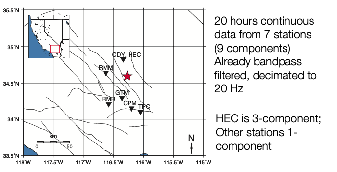
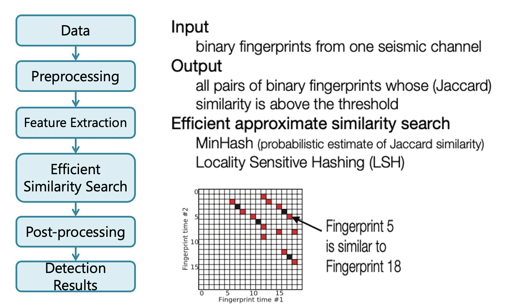
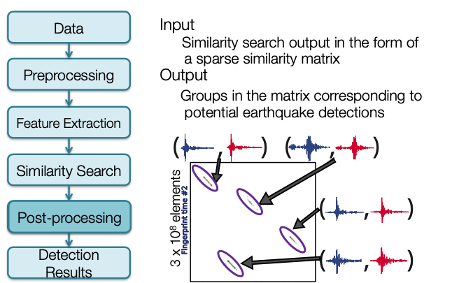

# **Tutorial**

## **Example Data: Hector Mine Foreshocks**

  

Decimated filtered waveform data (20 Hz sampling rate) to use for FAST: `data/waveforms${STATION}/Deci5*`
Original unfiltered waveform data (20 to 100 Hz sampling rate) to use for phase picking: `data/waveforms${STATION}/19991015*`


## **File Structure Overview**

### Code  

    fingerprint/          # Fingerprint
    simsearch/            # Similarity Search
    postprocessing/       # Postprocessing
    utils/                # Utility Functions
        preprocess/       
        network/          
        events/           
        run_fp.py         
        run_simsearch.py  

### Configuration and Parameters  

    parameters/            
        fingerprint/       
        simsearch/         
        postprocess/       

### Data  

    data/
        waveforms${STATION}/
            Deci5*${STATION}*.sac
            19991015*${STATION}*.sac

## **Feature Extraction**  


### Generate Fingerprints

* Create fingerprints for each of the 9 channels (7 stations) + global index, using wrapper
  
```
~/quake_tutorial$ python run_fp.py -c config.json
```

* Alternatively, to fingerprint a specific station, call the fingerprint script with the corresponding fingerprint parameter file:

``` 
~/quake_tutorial$ cd fingerprint/
~/quake_tutorial/fingerprint$ python gen_fp.py ../parameters/fingerprint/fp_input_CI_CDY_EHZ.json
```

### Global Index

!!! note
    Global index is already called by run_fp.py wrapper  

* Complete this step only ^^after^^ you have finished computing ^^fingerprints^^ for ^^every^^ component and station you want to use for detection.  
  
``` 
$ python global_index.py global indices.json
```

  - `global_index.py` **in** `fingerprint/`
  - `global_indices.json` **in** `parameters/fingerprint/`  
<br>
* Continuous data start/end times may be different, and time gaps may happen at different times, at different components and stations.  
* Global index: consistent way to refer to times of fingerprints at different components and stations.  

## **Similarity Search**



### Search for Similar Earthquake Pairs

* Compile and build C++ similarity search code.

``` bash
~/quake_tutorial$ cd simsearch/
~/quake_tutorial$ cmake .
~/quake_tutorial$ make
```  

* Similarity search for each of the 9 channels (7 stations), using wrapper  

``` bash
~/quake_tutorial/simsearch$ cd ..
~/quake_tutorial$ python run_simsearch.py -c config.json
```  

* Alternatively, to use similarity search for a specific station, call the similarity search script with the corresponding similarity search parameter file:

``` bash
~/quake_tutorial$ cd simsearch/
~/quake_tutorial$ cp ../parameters/simsearch/simsearch_input_HectorMine.sh .
~/quake_tutorial$ ./simsearch_input_HectorMine.sh
```

### FAST Similarity Search Output (1 Channel)  

`data/waveforms${STATION}/fingerprints`  
&nbsp;&nbsp;&nbsp;&nbsp;&nbsp;&nbsp; — MinHash Signatures (can delete these later)  
&nbsp;&nbsp;&nbsp;&nbsp;&nbsp;&nbsp;&nbsp;&nbsp;&nbsp;&nbsp;&nbsp;&nbsp;• `mh_${STATION}_${CHANNEL}_${nhash}.bin`  
&nbsp;&nbsp;&nbsp;&nbsp;&nbsp;&nbsp;&nbsp;&nbsp;&nbsp;&nbsp;&nbsp;&nbsp;• Example: `mh_CDY_EHZ_4.bin`  

&nbsp;&nbsp;&nbsp;&nbsp;&nbsp;&nbsp; — Binary files with similarity search output (npart files, one per partition, with first and last fingerprint index for the partition in filename):  
&nbsp;&nbsp;&nbsp;&nbsp;&nbsp;&nbsp;&nbsp;&nbsp;&nbsp;&nbsp;&nbsp;&nbsp;• `candidate_pairs_${STATION}_${CHANNEL}_${nhash},${ntbl}(${FIRST_FP_INDEX},${LAST_FP_INDEX})`   
&nbsp;&nbsp;&nbsp;&nbsp;&nbsp;&nbsp;&nbsp;&nbsp;&nbsp;&nbsp;&nbsp;&nbsp;• Example: `andiate_pairs_CDY_EHZ_4,2(0,74793)`  
&nbsp;&nbsp;&nbsp;&nbsp;&nbsp;&nbsp;&nbsp;&nbsp;&nbsp;&nbsp;&nbsp;&nbsp;• For efficiency, the output is binary format; need parsing to convert similarity search &nbsp;&nbsp;&nbsp;&nbsp;&nbsp;&nbsp;&nbsp;&nbsp;&nbsp;&nbsp;&nbsp;&nbsp;output to text files

### Parse FAST Similarity Search Output: [Binary --> Text File]

* Use the wrapper script to parse all 9 channels (7 stations)
```
~/quake_tutorial$ cd postprocessing
~/quake_tutorial/postprocessing$ cp ../parameters/postprocess/*.sh .
~/quake_tutorial/postprocessing$ ./output_HectorMine_pairs.sh
```

* Parse a Specific Channel
```
python parse_results.py –d <folder_with_binary_sim_search_files> -p <sim_search_filename_prefix> -i <global_index_file>
```

* **Example input file:** `candidate_pairs_CDY_EHZ_4,2(0,74793)`  
* **Example command:** 
```
$ python parse_results.py –d ../data/waveformsCDY/fingerprints/ candidate_pairs_CDY_EHZ –i ../data/global_indices/CDY_EHZ_idx_mapping.txt
```

## **Postprocessing**



### Postprocess: Combine FAST Similarity Search Output (3 Components @ 1 Station)  

* Combine similarity matrix from all components in each station, and copy outputs to `../data/inputs_network/` using wrapper script:  
    * `~/quake_tutorial/postprocessing$ cp ../parameters/postprocess/*.sh .`  
    * `~/quake_tutorial/postprocessing$ ./combine_HectorMine_pairs.sh`  

* Alternatively, to combine outputs (add “FAST similarity” for same fingerprint pair (index1, index2) ) from a specific station:  
    * `$ python parse_results.py –d <folder_with_text_sim_search_files> -p <text_sim_search_file_prefix> --sort true –parse false –c true –t <threshold>`  
    * **Example:** ` $ python parse_results.py –d ../data/inputs_network/ -p candidate_pairs_HEC --sort true –parse false –c true –t 6` 
        * Adds FAST similarity for same fingerprint pairs on HEC components: `candidate_pairs_HEC_BHE_merged.txt`, `candidate_pairs_HEC_BHN_merged.txt`, `candidate_pairs_HEC_BHZ_merged.txt`  
        * Output (one file per station): `candidate_pairs_HEC_combined.txt`  

        !!! warning
            By default, the *merged.txt files for all 3 components are deleted after combining! Copy them before this step if you want to keep them.

    * Usually set threshold=number of components * v, where v=nvote at a single component  
        * The threshold helps filter out matches generated from noise, since we require either strong matches at a single component, or weak matches at multiple components
        * May want to set threshold slightly lower (e.g., 2*v) if the output size is too small after combining

### Postprocess: Weight Stations Equally

* ‘Equalize’ across network: weighting stations with different number of components equally
    * Hector Mine example: one 3-component station (HEC) with similarity threshold at 6 votes, and 6 1-component stations with similarity threshold at 2 votes.
    * Want to weight each station equally, so multiply similarity in each 1-component station by 3
        * `$ awk ‘{print$1,$2,3*$3}’ candidate_pairs_CDY_EHZ_merged.txt > candidate_pairs_CDY_combined.txt`

* Another option: use only part of the data (e.g. vertical component at each station)


### Postprocess: Network Detection

* Run network detection (combine FAST results from all 7 stations):  
    * `~/quake_tutorial/postprocessing$ cp ../parameters/network/* .`  
    * `~/quake_tutorial/postprocessing$ python scr_run_network_det.py 7sta_2stathresh_network_params.json`  

Input file: `7sta_2stathresh_network_params.json`  

```
"io": {
    "channel_vars": ["CDY", "CPM", "GTM", "HEC", "RMM", "RMR", "TPC"],  # Station names
    "fname_template": "candidate_pairs_%s_combined.txt",                # Input file (to fill w/station name) 
    "base_dir": ”../data/",                                             # Base directory
    "data_folder": "inputs_network/",                                   # Input file directory
    "out_folder": "network_detection/"                                  # Output file directory
}
```  

### Network Detection Outputs

* Network Detection Output (text file with labeled columns)
    * Example (ranked in descending order of ‘peaksum’): `7sta_2stathresh_detlist_rank_by_peaksum.txt`  
    * First (num_sta=number of stations) columns: starting fingerprint index at each station (time information)  
        * Outputs “nan” if not observed at a particular station
    * `dL`: Maximum length (samples) along diagonal, over all event-pairs containing this event  
    * `nevents`: Number of other events ‘linked’ to (similar to) this event
    * `nsta`: Number of stations over which other events are similar to this event
    * `tot_ndets`: Total number of fingerprint-pairs (pixels) containing this event, over all event-pair clusters, over all stations
    * `max_ndets`: Maximum number of fingerprint-pairs (pixels) containing this event, over all event-pair clusters, over all stations
    * `tot_vol`: Total sum (or ‘volume’) of all similarity values (added over all stations), over all event-pairs containing this event
    * `max_vol:` Maximum sum (or ‘volume’) of all similarity values (added over all stations), over all event-pairs containing this event
    * `max_peaksum`: Maximum similarity value (added over all stations), over all event-pairs containing this event

### Example Custom Scripts to Clean up and Visualize Network Detection Results

* Depending on the parameters, network detection output text file might still have duplicate events
* We provide some example post-processing scripts to remove these duplicate events and come up with a final list of event detections
    * `cp ../utils/network/* .`
  
    !!! note
        These have not been fully tested. You may want
        to write your own instead! Need to modify input/output parameters within each script. 4 scripts: outputs of each script are inputs to the next script.

1. `~/quake_tutorial/postprocessing$ python arrange_network_detection_results.py`  
    1. Save only start and end fingerprint indices for each event (Firstnum_stacolumns --> 2 columns)
    2. Output 2 more columns at end
        1. `Num_sta`: number of stations that detected event
        2. `Diff_ind`: Difference between first and last fingerprint index
    3. **Example output:** `NetworkDetectionTimes_7sta_2stathresh_detlist_rank_by_peaksum.txt`

2. `~/quake_tutorial/postprocessing$ ./remove_duplicates_after_network.sh`  
    1. Remove events with duplicate start fingerprint index (keep events with highest num_sta then peaksum)
    2. **Example output:** `uniquestart_sorted_no_duplicates.txt`

3. `~/quake_tutorial/postprocessing$ python delete_overlap_network_detections.py`  
    1. Remove events with overlapping times: where start time of one event is before end time of another event
    2. **Example output:** `7sta_2stathresh_FinalUniqueNetworkDetectionTimes.txt`

4. `~/quake_tutorial/postprocessing$ ./final_network_sort_nsta_peaksum.sh`  
    1. Sort events in descending order of num_sta (number of stations that detected event), then peaksum (maximum similarity for this event)
    2. Should no longer have duplicate events
    3. **Example output:** `sort_nsta_peaksum_7sta_2stathresh_FinalUniqueNetworkDetectionTimes.txt`

### Final Thresholds: Visual/Manual Inspection

Now we have a list of detections — but are they actually earthquakes? We need to plot and visually inspect them.  

**Example script, view first 100 events:**  
```
~/quake_tutorial/utils/events$ python PARTIALplot_hector_detected_waveforms.py 0 100
```

   * Input finger indices from `sort_nsta_peaksum_7sta_2stathresh_FinalUniqueNetworkDetectionTimes.txt`  
   * Need global start time (t0) from global_idx_stats.txt, dt_fp in seconds  
   * Here t0 = UTCDateTime('1999-10-15T13:00:00.676000')  
   * Event time = t0 + dt_fp * (start finger print index)  
   * Cut short time window around event waveform in filtered data, plot across all stations, save image to png file with names ordered in descending order of num_sta, peaksum – does it look like an earthquake?  

Set final thresholds for num_sta, peaksum  

* **Example Output (first 50 events):**

```
EQ_sort_nsta_peaksum_7sta_2stathresh_FinalUniqueNetworkDetectionTimes.txt
```  

Additional post-processing scripts to remove false positive detections?  

### Final Event Detection List

**Example Script:**  
```
~/quake_tutorial/utils/events$ python output_final_detection_list.py
```  

**Example Input:**  
```
EQ_sort_nsta_peaksum_7sta_2stathresh_FinalUniqueNetworkDetectionTimes.txt
```

**Example Output:**  
```
FINAL_Detection_List_HectorMine_7sta_2stathresh.txt
```  

* **Column 1**: Event ID  
* **Column 2**: YYYY-MM-DDTHH:MM:SS.SSSS for event detection time. This is an approximate arrival time for the event (NOT origin time)  
* **Column 3**: Event detection time (seconds) since the start time for the first fingerprint, which for this data set is UTCDateTime('1999-10-15T13:00:00.676000')  
* **Column 4**: First fingerprint index (integer) for this event. Multiply by dt_fp = 1 second to get the time in column 2. Columns 1, 2, 3 basically represent the same information.  
* **Column 5**: Last fingerprint index (integer) for this event from the network-detection
* **Column 6**: Fingerprint index duration; column5 = column4-column3. Some sense of event duration
* **Column 7**: Number of stations at which the event was similar enough for a detection, the higher the better (nsta_thresh = 2)  
* **Column 8**: Peak sum of similarity for this event over all stations where it was detected, the higher the better (more similar to some other event).
* Detection list is ordered in descending order of number of stations (Column 6), then in descending order of peaksum similarity (Column 7).  

Further processing is required for P/S phase picking and location:  

  * Cut SAC files  
  * Pick phases (automatic or manual)  
  * Locate earthquakes  
  * Compute magnitudes  

!!! info
    * The following tutorials are not a part of FAST, but are optional next steps to take for phase picking with SeisBench, earthquake location with HYPOINVERSE, and mapping/visualization with PyGMT.
    * The same commands below should run within the [Docker container](setup_docker.md), but replace the path `~/FAST/` with `root@555d364b63d7:/app/FAST/`

## **Phase Picking**  

### Cut SAC Files  

* Cut short event waveform files in SAC format from the continuous seismic data at all stations, based on the detection results from FAST.
* Cut from the original unfiltered continuous seismic data at full sampling rate (usually 100 sps), not the decimated filtered continuous seismic data used to run FAST.
* In this example, the event waveform time windows are 180 seconds long, 60 seconds before detection time, 120 seconds after detection time.

```
(eq_fast) ~/FAST/utils/events$ python cut_event_files.py
```  

* Check for cut files in:  

```
(eq_fast) ~/FAST/data/event_ids
```

* Example:  


### Install SeisBench  

```
(eq_fast) ~/FAST/utils/events$ cd ../..
(eq_fast) ~/FAST$ pip install seisbench
```

### Pick Phases (automatically)  

* Run SeisBench script for all events and all stations. This can take a few minutes to finish running.

```
(eq_fast) ~/FAST$ cd utils/picking
(eq_fast) ~/FAST/utils/picking$ python run_seisbench.py
```  

* Annotated plots are found in:  

```
(eq_fast) ~/FAST/data/seisbench_picks/
```


* Example annotated plot from event 00000000:  


Output saved in:
```
(eq_fast) ~/FAST/data/seisbench_picks/event_picks.json
```  

Example output:  


* "peak_time": Arrival time of pick
* "peak_value": Probability of pick

## **Earthquake Location**  

The output from `run_seisbench.py` in the `event_picks.json` file contains the information needed to locate the detected earthquakes from the FAST final detection list. We use HYPOINVERSE to locate earthquakes from the picks found with `run_seisbench.py`.  

HYPOINVERSE is the standard location program supplied with the Earthworm seismic acquisition and processing system (AQMS). Read more about it [here](https://www.usgs.gov/software/hypoinverse-earthquake-location).  

### Formatting input data for HYPOINVERSE

To begin earthquake location run the following to format the phase picks for HYPOINVERSE:  

```
(eq_fast) ~/FAST/utils/picking$ cd ../location/
(eq_fast) ~/FAST/utils/location$ python SeisBench2hypoinverse.py
```  

Output:
```
~/FAST/data/location_hypoinverse/EQT_19991015_test.txt
```

The script `SeisBench2hypoinverse.py` will also copy the following files from `~/FAST/utils/location/` to the directory `~/FAST/data/location_hypoinverse/` where we will run HYPOINVERSE:
```
   *   hadley.crh
   *   locate_events.hyp
```

Get Hector Mine Station List as a json file:
```
(eq_fast) ~/FAST/utils/location$ cd ../preprocess/
(eq_fast) ~/FAST/utils/preprocess$ python get_station_list.py
```

Output:
```
~/FAST/data/stations/station_list.json
```

Convert `station_list.json` to HYPOINVERSE station input format in `station_list.sta`:
```
(eq_fast) ~/FAST/utils/preprocess$ cd ../location/
(eq_fast) ~/FAST/utils/location$ python output_station_file.py
```

Output:
```
~/FAST/data/location_hypoinverse/station_list.sta
```

### Install and Run HYPOINVERSE

Check that GFortran is installed, since it is required to compile the HYPOINVERSE program from source:
```
(eq_fast) ~/FAST$ gfortran --version
```  

Example expected output:  
==GNU Fortran (Ubuntu 7.5.0-3ubuntu1~18.04) 7.5.0==  

If GFortran is not installed, run:  
```
(eq_fast) ~/FAST$ apt-get update && apt-get upgrade
(eq_fast) ~/FAST$ apt-get install gfortran
```

Download HYPOINVERSE [here](https://www.usgs.gov/software/hypoinverse-earthquake-location), expand the `hyp1.40.tar` file,
move the resulting `hyp1.40/` directory to `~/FAST/utils/location/hyp1.40/`. This can be done with the following commands:
```
(eq_fast) ~/FAST/utils/location$ wget -c https://escweb.wr.usgs.gov/content/software/HYPOINVERSE/hyp1.40.tar
(eq_fast) ~/FAST/utils/location$ mkdir hyp1.40
(eq_fast) ~/FAST/utils/location$ cd hyp1.40
(eq_fast) ~/FAST/utils/location/hyp1.40$ tar -xvf ../hyp1.40.tar
(eq_fast) ~/FAST/utils/location/hyp1.40$ ls -l
drwxr-xr-x  4 10003  124   128 Sep 10  2014 doc
-rw-r--r--  1 root  root 77392 Sep 10  2014 hyp1.40-release-notes.pdf
-rw-r--r--  1 root  root  3258 Sep 10  2014 hyp1.40-release-notes.txt
drwxr-xr-x 54 10003  124  1728 Sep 10  2014 source
drwxr-xr-x 13 10003  124   416 Aug 26  2014 testone
```

Before compiling HYPOINVERSE, we need to make changes to `makefile` in `~/FAST/utils/location/hyp1.40/source/`:
```
(eq_fast) ~/FAST/utils/location/hyp1.40$ cd source
(eq_fast) ~/FAST/utils/location/hyp1.40/source$ sed -i '/calnet/d' makefile
(eq_fast) ~/FAST/utils/location/hyp1.40/source$ sed -i 's/g77/gfortran/g' makefile
```

* Remove lines **16** and **230**

```  py linenums="16"
cp hyp1.40 /home/calnet/klein/bin
```  

```  py linenums="230"
cp p2sdly /home/calnet/klein/bin
```  

* Find and replace: `g77` with `gfortran`

**Check that HYPOINVERSE runs**:

* Compile HYPOINVERSE:
```
(eq_fast) ~/FAST/utils/location/hyp1.40/source$ make
```  

* Make it executable:  
```
(eq_fast) ~/FAST/utils/location/hyp1.40/source$ chmod +x hyp1.40
```  

* Run HYPOINVERSE:  
```
(eq_fast) ~/FAST/utils/location/hyp1.40/source$ ./hyp1.40
```  

* Expected output:
```
HYPOINVERSE 2000 STARTING
6/2014 VERSION 1.40 (geoid depth possible)
 COMMAND?
```   

If you have this output, HYPOINVERSE is running correctly. Press ctrl-c to exit.

### Run HYPOINVERSE

Run HYPOINVERSE within the directory `~/FAST/data/location_hypoinverse/`:
```
(eq_fast) ~/FAST/utils/location$ cd ../../data/location_hypoinverse/
(eq_fast) ~/FAST/data/location_hypoinverse$ ../../utils/location/hyp1.40/source/hyp1.40
```  

Use **@locate_events.hyp** as input:
```
HYPOINVERSE 2000 STARTING
6/2014 VERSION 1.40 (geoid depth possible)
 COMMAND? @locate_events.hyp
```  

Expected output:
   

You should see output files called `locate_events.sum` and `locate_events.arc` in HYPOINVERSE Y2000 summary format, but these are difficult to read.

!!! note
    `locate_events.arc` has the event info, and phase pick info for each event. `locate_events.sum` has only the event info, no phase pick info.

Use `output_hypoinverse_as_text.py` to output `locate_events.sum` in a more readable format to use for plotting and visualization.

```
(eq_fast) ~/FAST/data/location_hypoinverse$ cd ../../utils/location/
(eq_fast) ~/FAST/utils/location$ python output_hypoinverse_as_text.py
```

## **Plotting Earthquake Locations with PyGMT**

### Install PyGMT

IMPORTANT - PyGMT needs to be installed and run in a separate `pygmt` conda environment, since it is incompatible with the `eq_fast` conda environment.

First, exit the `eq_fast` conda environment
```
(eq_fast) ~/FAST/utils/location$ conda deactivate
```

Next, create the `pygmt` conda environment with its dependencies, as described in the [PyGMT install page](https://www.pygmt.org/latest/install.html)
```
(base) ~/FAST/utils/location$ conda config --prepend channels conda-forge
(base) ~/FAST/utils/location$ conda create --name pygmt python=3.9 numpy pandas xarray netcdf4 packaging gmt
```

Finally, enter the `pygmt` conda environment and install PyGMT
```
(base) ~/FAST/utils/location$ conda activate pygmt
(pygmt) ~/FAST/utils/location$ conda install pygmt
```

### Create a PyGMT map of earthquake locations and seismic stations

```
(pygmt) ~/FAST/utils/location$ cd ../mapping/
(pygmt) ~/FAST/utils/mapping$ python hypoinverse_to_pygmt.py
```

Figure saved as `pygmt_hectormine_map.png` in `~/FAST/data/mapping_pygmt/`

**Map Output**:  

#
