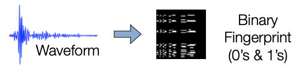

## **Example Data: Hector Mine Foreshocks**


<br></br>

* 20 hours of continuous data from 7 stations (9 components). <br>
* The data is already bandpass filtered, decimated to 20 Hz. HEC is 3-components; other stations are 1-component.

<br></br>

<p align="center">waveform data: <span style="color: red;">data/waveforms${STATION}/Deci5*</span></p>

## **File Structure Overview**

### *Code*  
&nbsp;&nbsp;&nbsp;&nbsp;&nbsp;&nbsp;Fingerprint: <span style="color: red;">fingerprint/</span>  
&nbsp;&nbsp;&nbsp;&nbsp;&nbsp;&nbsp;Similarity Search: <span style="color: red;">simsearch/  </span>  
&nbsp;&nbsp;&nbsp;&nbsp;&nbsp;&nbsp;Postprocessing: <span style="color: red;">postprocessing/</span>  
&nbsp;&nbsp;&nbsp;&nbsp;&nbsp;&nbsp;Utility Functions:  
&nbsp;&nbsp;&nbsp;&nbsp;&nbsp;&nbsp;&nbsp;&nbsp;&nbsp;&nbsp;&nbsp;&nbsp;<span style="color: red;">utils/preprocess</span>  
&nbsp;&nbsp;&nbsp;&nbsp;&nbsp;&nbsp;&nbsp;&nbsp;&nbsp;&nbsp;&nbsp;&nbsp;<span style="color: red;">utils/network</span>  
&nbsp;&nbsp;&nbsp;&nbsp;&nbsp;&nbsp;&nbsp;&nbsp;&nbsp;&nbsp;&nbsp;&nbsp;<span style="color: red;">utils/events</span>  
&nbsp;&nbsp;&nbsp;&nbsp;&nbsp;&nbsp;&nbsp;&nbsp;&nbsp;&nbsp;&nbsp;&nbsp;<span style="color: red;">run_fp.py</span>  
&nbsp;&nbsp;&nbsp;&nbsp;&nbsp;&nbsp;&nbsp;&nbsp;&nbsp;&nbsp;&nbsp;&nbsp;<span style="color: red;">run_simsearcg.py</span>  

### *Configuration and Parameters*  
<span style="color: red;">
&nbsp;&nbsp;&nbsp;&nbsp;&nbsp;&nbsp;<span style="color: red;">parameters/</span>  
&nbsp;&nbsp;&nbsp;&nbsp;&nbsp;&nbsp;&nbsp;&nbsp;&nbsp;&nbsp;&nbsp;&nbsp;<span style="color: red;">ufingerprint/</span>  
&nbsp;&nbsp;&nbsp;&nbsp;&nbsp;&nbsp;&nbsp;&nbsp;&nbsp;&nbsp;&nbsp;&nbsp;<span style="color: red;">usimsearch/</span>  
&nbsp;&nbsp;&nbsp;&nbsp;&nbsp;&nbsp;&nbsp;&nbsp;&nbsp;&nbsp;&nbsp;&nbsp;<span style="color: red;">upostprocess/</span>  
</span>

### *Data*  
&nbsp;&nbsp;&nbsp;&nbsp;&nbsp;&nbsp;<span style="color: red;">data/waveforms${STATION}/Deci5*</span>

## **Feature Extraction**  


### *Input*  

&nbsp;&nbsp;&nbsp;&nbsp;&nbsp;&nbsp;continuous seismic data from a channel

### *Output*  

&nbsp;&nbsp;&nbsp;&nbsp;&nbsp;&nbsp;a binary fingerprint for each overlapping segment of the original &nbsp;&nbsp;&nbsp;&nbsp;&nbsp;waveform

### *Key Property*  

&nbsp;&nbsp;&nbsp;&nbsp;&nbsp;&nbsp;similarity of the binary fingerprints approximates that of the &nbsp;&nbsp;&nbsp;&nbsp;&nbsp;original waveforms  


## **Generate Fingerprints**

* Create fingerprints for each of the 9 channels (7 stations) + global index, using wrapper
```
~/quake_tutorial$ python run_fp.py -c config.json
```

* Alternatively, to fingerprint a specific station, call the fingerprint script with the corresponding fingerprint parameter file:
```
~/quake_tutorial$ cd fingerprint/
~/quake_tutorial/fingerprint$ python gen_fp.py ../parameters/fingerprint/fp_input_CI_CDY_EHZ.json
```



## **Global Index**

!!! note
    Global index is already called by run_fp.py wrapper  

* Complete this step only ^^after^^ you have finished computing ^^fingerprints^^ for ^^every^^ component and station you want to use for detection.  
```
$ python global_index.py global indices.json
```