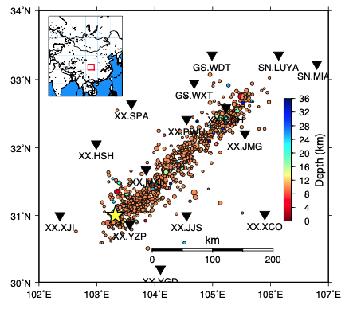
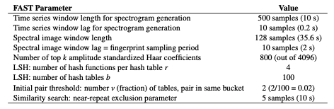

# 0.7 SeismOlympics: Wenchuan Aftershocks  

!!! info 
    Alibaba Cloud and the China Earthquake Administration sponsored a ”SeismOlympics” programming competition to detect aftershocks of the deadly May 12, 2008 Mw 7.9 Wenchuan, China, earthquake [Fang et al., 2017], similar to the Netflix Prize or the Kaggle data science competitions. Competitors from seismology, machine learning, signal processing, computer science, and other backgrounds developed algorithms that automatically detect and pick phases on aftershock waveforms while avoiding false positive detections. Performance was evaluated against phases picked by human analysts. This was a great opportunity to test how the FAST earthquake detection algorithm measured up against other methods. Other members of my team, all from Stanford Geophysics (Mostafa Mousavi, Yixiao Sheng, Weiqiang Zhu) used machine learning to pick phases and recognize false detections. We finished in 27th place in the first round of competition, and 16th place in the second round.  

  

<figcaption>Figure 11: Map of 15 stations in Wenchuan, China used for FAST detection of small earthquakes in 3 months of continuous data. The ComCat catalog had 1039 aftershocks (circles colored by depth, sized by relative magnitudes 3.2 ≤ M ≤ 6.1) inside the boundaries of this map during the detection time period. The yellow star denotes the location of the Mw 7.9 Wenchuan earthquake on 2008-05-12.
</figcaption>  

After the competition, I applied FAST to detect earthquakes within the entire continuous data set provided in both rounds of competition. 3 months of seismic data: April 1-22, 2008 (foreshocks), July 1-August 31, 2008 (aftershocks), at 15 stations (Figure 11) with 3 components each, although some stations only have data for part of this time. For all 45 channels, I applied the following preprocessing: 1-20 Hz bandpass filter, then decimated to 50 Hz (factor of 2, from original 100 Hz); also, all time gaps with 0’s were filled with uncorrelated random noise. FAST detected about 12,000 earthquakes; some of them are teleseismic because the 1-20 Hz filter includes lower frequencies.  

Table S18: FAST input parameters for Wenchuan 2008 aftershock detection, applied to each component at each station. For the median statistics calculation (for wavelet coefficient selection), we randomly sampled 10% of the data, once per day. Total number of fingerprints (largest number over all channels): 3,612,972.  

  

Table S19: Network detection input parameters for Wenchuan 2008 aftershock detection at 15 stations, after getting similar pairs of fingerprints from FAST for each station — added similarity from all 3 [HHE,HHN,HHZ] components at a given station and set station-pair threshold of (v=2)*(3 components) = 6.  

  

Table S20: Final thresholds for Wenchuan 2008 aftershock detection applied to network detection parameters nsta (number of stations that detected event pair) and peaksum (total similarity score at all stations) to determine list of earthquakes, set empirically after visual inspection. For each value of nsta, a different threshold for peaksum can be applied.  

  