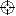
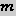
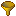
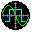
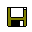
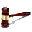
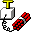

# Getting Started with Jiggle

This section of the guide summarizes the typical post-processing workflow for
improving a single event solution within Jiggle.  This section is simply a
general overview and intended to provide a first introduction to the GUI; 
please refer to the individual pages about each main Jiggle tab view
for a thorough reference.

<!--
1. [Start Jiggle and load catalog view](#step-1-startup)
2. [Load single event from database (Catalog View)](#step-2-load-single-event-from-database-catalog-view)
3. [Modify picks and amplitudes on event waveform channels (Waveform
View)](#step-3-modify-picks-and-amplitudes-on-event-waveform-channels-waveform-view)
4. [Recalculate event location and origin time (Location
View)](#step-4-recalculate-event-location-and-origin-time-location-view) 
5. [Recalculate event magnitude (Magnitude
View)](#step-5-recalculate-event-magnitude-magnitude-view)
6. [Save and finalize improved earthquake solution to
database](#step-6-save-and-finalize-improved-earthquake-solution-to-database)
7. [Preview and load next event to process](#step-7-preview-and-load-next-event-to-process)
-->

## Jiggle GUI Five Main Views

Jiggle has five main "tab" views. In the screenshot below, the Tab
views navigation icons are labeled. From left to right, the tab views can be accessed by either clicking on
the appropriate Tab view icon (below) or pressing a key (all keys below are
capital letters, so the Shift key must be held down):

1. [Location View](../locationview)&nbsp;&nbsp;, or
press '<b>L</b>', to review and refine location estimates.
2. [Magnitude
View](../magnitudeview)&nbsp;&nbsp;,
or press '<b>M</b>', to review and refine magnitude estimates.
3. Message View&nbsp;&nbsp;, or press '<b>T</b>', for displaying miscellaneous information.
4. [Catalog
View](../catalogview)&nbsp;&nbsp;, or
press '<b>C</b>', for showing event catalog.
5. [Waveform View](../waveformview)&nbsp;&nbsp;,
or press '<b>W</b>', for picking arrival times, amplitudes, and codas.

The Jiggle GUI is currently in the [Catalog View](../catalogview) (the
 icon tab has a gray background).  The
icons in the "Catalog view actions" red box under
the "Tab views" icons are specific to the Catalog
View, and are not found in the other 4 tab views.  See the [Catalog
View](../catalogview) section for a full description of the possible "Catalog view actions"; some of these actions apply only
to the selected catalog event (white row with event ID 38466968 in the
screenshot).

Some Jiggle GUI elements are seen in all 5 tab views.  The GUI has a "Menu bar" (<b>File</b>, <b>View</b>, ... , <b>Help</b>
in the red box) at the top to take various actions, a toolbar row of icons just
under the menu bar (starting with the "Map" red
box), and a "Status bar" in the red box at the
bottom right with database information. 

## Step 1, start Jiggle and load catalog view

Let's run Jiggle from the command line, with input parameters from
`jiggle_waves.props`:

    $ ./run_jiggle.sh ../prop/jiggle_waves.props

 
The "<b>Event Selection Properties</b>" dialog box (below) appears.  The "<b>User</b>"
input properties file status should be "<b>exists: true</b>".  It is ok if the
"<b>Default</b>" properties files has "<b>exists: false</b>". Click the <b>OK</b>
button.

 
Next, the "<b>Database Connection Info</b>" dialog box (below) appears.  These
values are pre-populated by the [properties files](../properties). They are
required to connect to the Oracle or Postgres database containing earthquake
information through the JDBC API. SCSN-specific inputs are shown below: the name
of the server hosting the database is `blanchard.gps.caltech.edu`, and the database
name is `archdbe`.  The JDBC connection is through a 4-digit port number, which
should replace the `PORT` placeholder.  Database credentials would be indicated
next to "<b>User:</b>", where the username would replace the `USERNAME`
placeholder, and the password next to "<b>Password:</b>". Click the <b>OK</b>
button to proceed.

 
Jiggle connects to the database, retrieves earthquake event data from it, and
displays the catalog in tabular form (screenshot below). Which events are shown is controlled
by the properties in the eventSelection.props file. The columns of the catalog, as well as the
colors of the catalog rows can be customized by changing property values. The first catalog view example 
is from SCSN and is described in more detail below. The second catalog view is from PNSN and has a 
color scheme based on the geographic type instead of event review status.

*  No events have been loaded yet, so many of the icons in the top row of the
   GUI, as well as the “Event” in the menu bar, are grayed out and inaccessible.
   In the Status bar (lower right corner), the
   event-specific statistics all have zero values.
    *  The third entry in the Status bar shows
       the database name @ server name (e.g. <b>archdbe@blanchard</b>).
*  The number of events (rows) displayed is shown in the bottom left corner
   ("Table has 157 rows").
*  Events in the "green" rows have
   been inspected and finalized by human analysts. These have a value of
   "<b>F</b>" in the "ST" column.
*  Events in the "yellow" rows have
   been accepted for further review by analysts. These have a value of "<b>H</b>"
   in the "ST" column.
*  Events in the "pink" rows are
   automatic solutions that have not yet been checked by analysts. These have a
   value of "<b>A</b>" in the "ST" column.

See the [Catalog View](../catalogview) section for further details.

 
Clicking on the Map icon
 in the catalog view above will open a new window
with locations of catalog events from the database (cyan circles sized by
magnitude) in map view (below).  The map also displays locations of seismic stations
(light green triangles), cities (red squares with green lettering), historic
earthquakes (red stars), quarries (purple X's), and faults (orange lines), which
are are each a separate map layer that can be toggled on and off.  Pan and zoom
in/out are possible.  As with the catalog view, colors and other features of the map
can be customized.  See the [Map Layer View](../maplayerview) section for more
detail about viewing catalog events on the map.

 

## Step 2: Load single event from database (Catalog View)

In the screenshot in the [Jiggle GUI Five Main Views](#jiggle-gui-five-main-views)
section, many of the icons in the top toolbar row of the GUI, as well as the
"<b>Event</b>" in the "Menu bar", are currently
grayed out and inaccessible, because an event has not yet been selected and
loaded into Jiggle.  To activate these icons, we need to select and load a
specific event (row in the table) by taking one of the following actions:

*  In Catalog View, double-click on the event row 
*  In Catalog View, select the event row (highlighted in white) and click the
   green arrow &nbsp;&nbsp;
   (right-most icon in "Catalog view actions")  
*  In Catalog View, select the event row (highlighted in white), right-click to
   open a popup menu, and click on "<b>Load</b>"
*  In Catalog View, select the event row (highlighted in white) and click on
   "Menu bar": <b>File</b> &rarr; <b>Open Catalog
   Selection</b>
*  In Map Layer View, double-click on the event location (cyan circle)
*  In "Menu bar": <b>File</b> &rarr; <b>Open
   event by id...</b>, type in 8-digit event ID number (e.g. 37536154) 

 
The screenshot below shows the Jiggle GUI, still in [Catalog
View](../catalogview), after an earthquake event (with ID 37536154) has been
selected and loaded.  The event ID 37536154 next to an orange square now appears
in the "<b>Selected Solution</b>" box.  Information for the loaded event also
appears in the title bar.  Most of the icons in the top row of the GUI including
those in the "Event Editing" box, as well as the
"<b>Event</b>" in the "Menu bar", are now
accessible. The Status bar (lower right corner)
now displays statistics for this event.

 
Clicking on the "Gazetteer" icon &nbsp;
 &nbsp; in the top toolbar displays the distance
and direction from the loaded event (ID 37536154) to nearby cities and other
locations of interest (screenshot below).

 
In the [Map Layer View](../maplayerview) (screenshot below), a pink arrow points
to the location of the loaded event, and the information for the loaded event
with ID 37536154 appears in the title bar.

## Step 3: Modify picks and amplitudes on event waveform channels (Waveform View)

The [Waveform View](../waveformview) can then be selected to view waveforms for
the loaded earthquake event (ID 37536154, seen in the "<b>Selected Solution</b>"
box).  Notice that the Waveform View  icon now is
highlighted with a blue background within the "Tab views
" red box.  The "Status bar" (red box,
bottom right) shows statistics for this loaded event: 3738 channels at 660
stations, 30 arrival time picks, 62 peak amplitudes (amps), and 0 coda estimates. 

Various categories of tools available only in the Waveform View are grouped into
red boxes within the screenshot:

*  Time zoom
*  Pick tools
*  Amplitude zoom
*  Filter single channel
*  Triaxial display
*  Manual time zoom
*  Waveform scroll and selection
*  Filter all waveforms

Icons in the main toolbar for relevant actions within the Waveform View are also
grouped into red boxes within the screenshot:

*  New event
*  Waveform views
*  Auto-picker
*  Show only certain waveforms
*  [Scope Mode](../scopemode)

The channels are read in from a cache file for faster loading, which is
refreshed every time Jiggle starts up (click the <b>YES</b> button in the
screenshot below to reload the channel list). (TODO check for accuracy)

The "All event waveforms" bottom window in the
Waveform View screenshot displays the 3-minute-duration event waveforms for all
3738 channels at 660 seismic stations, ordered by increasing distance from the
event location to each station.  To view waveforms from all of the channels, use
the scrollbar or the tools in the "Waveform scroll and
selection" red box.  Waveforms from some channels may not always appear
due to gaps in the data.  The event waveforms can be read from a database
containing either triggered or continuous waveforms.

Each waveform is named with the `${NETWORK}.${STATION}.${CHANNEL}` convention,
e.g. for `CI.TUQ.HHZ`, the network code is `CI`, the station name is `TUQ`, and
the channel name is `HHZ`.  See the [Station Naming Convention SCSN Wiki
Page](http://scsnwiki.gps.caltech.edu/doku.php?id=stations:station_naming) or
[SCEDC SEED Channel Descriptions](http://scedc.caltech.edu/station/seed.html)
for more details.

A single station usually has multiple channels, which can record the ground
motion from the earthquake in three different directions:

*  `HHZ`: vertical
*  `HHN`: horizontal, north-south
*  `HHE`: horizontal, east-west

In addition, a single station usually has differences in sampling rate,
frequency range, or gain, which are reflected in different colors for the
waveforms in the Waveform View.

*  `HHZ`, `HHN`, `HHE`: high sample-rate broadband (black)
*  `HNZ`, `HNN`, `HNE`: high sample-rate accelerometer (olive)
*  `BHZ`, `BHN`, `BHE`: low sample-rate broadband (cyan)
*  `EHZ`: extremely short period (blue)

The "Single channel event waveform" top window in
Waveform View shows a waveform from one channel at a time.  In the "All event waveforms" window, the selected channel
`CI.TUQ.HHZ` is shown as a light
blue row, and the yellow box
indicates the section of the waveform displayed in the "
Single channel event waveform" window.  The tools in the "Time zoom" and "Manual time
zoom" red boxes allow zooming in and out along the time axis for this
channel, while the tools in the "Amplitude zoom
red box allow zooming in and out in the amplitude dimension; the yellow box changes shape accordingly. 

The Waveform View also provides an alternative triaxial view (TODO place link),
which displays 3 channels of event waveforms (vertical, north-south, east-west)
at a time, all from the same station.  In the "All event
waveforms" window, this can be accomplished with the "Waveform views" tools (red box in the main toolbar),
but requires several setup steps (TODO place link).  In the "Single channel event waveform" window, the "Triaxial display"
 tool overlays these 3 channels
on top of each other.

Users can apply different types of filters (e.g. bandpass, highpass, lowpass) to
the event waveforms. The "Filter all waveforms"
 tool in the bottom right corner applies
the selected filter to all channels in the "All event
waveforms" window.  The "Filter single
channel"  tool filters only the
data in the "Single channel event waveform"
window.

Within the Waveform View, users can modify arrival time picks (e.g. <b>iPc0</b>, <b>eS 2</b>), and peak amplitude
estimates, often called "amps" (small orange triangles on HHN and HHE channels),
to improve their quality.  Changing the picks will change the earthquake origin
(location and origin time), and changing the amps will change the earthquake
magnitude.

*  These picks and amps, initially obtained from the AQMS real-time (RT) system,
   are loaded from the database. The "Status bar"
   (bottom right) shows a total of 30 arrival picks and 62 amps.
*  The "Show only certain waveforms" tools (red
   box, top right) displays only the waveforms with an existing pick (P) or amp
   (A) in the "All event waveforms" window (TODO:
   explain C).
*  Green vertical bars in the
   "Single channel event waveform" and "All event waveforms" windows indicate approximate
   expected P (earlier) and S (later) arrival times at each station. If the
   actual phase picks deviate significantly from the green bars, then the event
   is mislocated.
*  The "Auto-picker" 
   in the tool bar can be used to automatically pick P and S arrival times.
   Parameters for the Auto-picker are in the `pickEW.props` [properties
   file](../properties).
*  Users can also manually pick arrivals within the "Single channel event waveform" window using the
   "Pick tools", aided by the zoom features.
   Users can add new manual picks at channels on stations without picks, and
   delete poor quality automatic picks.
*  Picking is usually done on channels with higher sample rate; P phases are
   usually picked on the vertical channel and S phases on the horizontal
   channels.
*  Picking is done on stations out to a distance of about 120 km; further
   stations are probably too noisy to reliably determine picks.
*  Amps determined by the RT system can be rejected if manual inspection shows
   that they are incorrect.
*  Right-click in either the "All event
   waveforms" or "Single channel event
   waveform" window to bring up a menu with many options.

Sometimes the "All event waveforms" window might
show two (or more) earthquake waveforms, which happened close together in time,
for a single catalog event. In this case, one can use the "New event"  tool to clone
the waveforms from the catalog event into a new event (TODO link).  Then users
can pick arrivals and estimate amplitudes on the second event waveform (that was
originally not in the catalog), determine its origin and magnitude, and save it
to the database.

In addition to viewing event waveform data, users can also view continuous
seismic waveform data within Jiggle by turning on [Scope mode](../scopemode)
.

## Step 4: Recalculate event location and origin time (Location View)

The [Location View](../locationview) can be selected to view the origin
(location and origin time) information for the loaded earthquake event (with ID
37536154, "<b>Selected Solution</b>" box).  Notice that the Location View
 icon now is highlighted with a gray background within
the "Tab views" red box.

The event origin is calculated using the
[HYPOINVERSE](https://www.usgs.gov/software/hypoinverse-earthquake-location)
earthquake location program.  At the SCSN, HYPOINVERSE runs on a separate
server, called the "solution server" or "solserver".  HYPOINVERSE uses the P and
S arrival time picks at different stations, along with a 1D flat-layer velocity
model, to solve for the best-fit event origin (latitude, longitude, depth,
origin time). The SCSN uses the <kbd>HK_SOCAL</kbd> velocity model (<i>Hadley
and Kanamori, 1977</i>), available as Table 5 in [(<i>Hutton et al.,
2010</i>)](http://scedc.caltech.edu/about/BSSA_2010_Hutton_SCSN_cat.pdf).

*  Initially, users see the event origin calculated by HYPOINVERSE using picks
   from the RT AQMS system as input.
*  The yellow window with "Event origin
   solutions" contains the event origin (location and origin time) and
   other parameters output from running HYPOINVERSE.
*  The "Pick information" window shows the picks
   on each channel that were used to calculate the event origin.
*  Clicking the "Calculate Location"
    tool runs HYPOINVERSE again, this time using
   improved (automatic and/or manual) pick estimates from the [Waveform
   View](../waveformview) for this event.

## Step 5: Recalculate event magnitude (Magnitude View)

The [Magnitude View](../magnitudeview) can be selected to view the magnitude
information for the loaded earthquake event (with ID 37536154, "<b>Selected
Solution</b>" box).  Notice that the Magnitude View 
 icon now is highlighted with a gray
background within the "Tab views" red box.

Magnitudes depend on peak amplitude estimates that were initially determined by
AQMS RT, but can be modified in the [Waveform View](../waveformview) (small
orange triangles) for the loaded event.  Magnitudes also depend indirectly on
the event location, since the distance from the event to each station with an
amplitude estimate is used to calibrate the magnitude; therefore, after
recalculating the event location with HYPOINVERSE, magnitude should also be
updated.

There are different algorithms for calculating the magnitude of an earthquake in
Jiggle, which can be done with the "Calculate
Magnitude"  
tools: 

*  ML: Local magnitude
    *  Generally used as "prefmag" (preferred magnitude) for small (M < 3) local
       earthquakes?
    *  Calculated with the peak amplitude on the horizontal (north-south,
       east-west) channels, and amplitudes are calibrated to magnitude by using
       the distance from event to each station.
*  Md: Duration magnitude
    *  TODO: when/how used?  Generally used for small earthquakes.
    *  Calculated using the time duration of the coda after the S-wave.

Jiggle currently does not have functionality to calculate the following
magnitude types, which are commonly used for larger (M > 6) earthquakes.  These
types may be visible in the database, as they might be imported from AQMS RT or
from other seismic networks.

*  Me: Energy magnitude
    *  First available magnitude for large (M > 6) earthquakes, before
       Mw
*  Mw: Moment magnitude
    *  Most reliable magnitude estimate for large (M > 6) earthquakes
    *  Reflects dimensions of the earthquake, without saturating for the largest
       earthquakes.
    *  Calculated with a moment tensor fit.
*  Mh: Human-edited magnitude
    *  This magnitude type can be set in DRP
    *  Usually seen for exotic events (e.g. chemical blast)
    *  Sometimes saved as "Intermediate" processing state events, flagged for
       further analysis later
*  Mun: Unknown magnitude
    *  Usually seen for regional or teleseismic earthquakes outside network
       boundaries, with catalog solution imported from other networks

The "Magnitude type views" tabs, available only
within the Magnitude View, allow toggling between these different magnitude
estimates.  In the screenshot above, only ML is available for event
ID 37536154, but additional entries for other magnitude types (e.g.
Md, Me) are possible.  One of these magnitude types should
be set as the preferred type, which will then appear as "EVENT PREFERRED" in the
top left corner within the selected Magnitude type view.

In each Magnitude type view, the yellow window with "Event magnitude solution" contains the event magnitude
and other relevant parameters, while the "Amp
information" window shows the peak amplitude estimates on each channel
that were used to calculate the event magnitude.

## Step 6: Save and finalize improved earthquake solution to database

At this point, the user has manually inspected picks and amps on event
waveforms, and calculated an improved event origin (location and origin
time) and magnitude within Jiggle.  In order to save this improved solution to
the database, click on the "Save event"  tool. 

In the Catalog View (screenshot below), the saved event appears as an orange row, the "ST" column has the letter "<b>I</b>" indicating
that the intermediate solution was saved, the "SRC" column says "<b>Jiggle</b>" indicating that the
solution was modified within Jiggle, and the "OWHO" column has the string "<b>cyoon</b>" indicating
the name of the user who changed the solution.

To permanently save the improved solution to the database, without allowing any
further edits, the user can finalize the event solution within the database by
clicking on the "Finalize event"  tool.

In the Catalog View (screenshot below), the finalized event appears as a green row, the "ST" column has the letter "<b>F</b>" indicating
that the solution was finalized, the "SRC" column
says "<b>Jiggle</b>" indicating that the solution was modified within Jiggle,
and the "OWHO" column has the string
"<b>cyoon</b>" indicating the name of the user who changed the solution.

The [Database Actions](../databaseactions) section has more information about
how to save  or finalize  an
event.  This section also describes how to delete an event
 that is not an earthquake, or to clone a new event
 if an existing catalog event window has more than
one earthquake waveform.

## Step 7: Preview and load next event to process

At this time, the user can select and load the next event to process in Jiggle.
The user can choose to load the next event by following instructions in [Step
1](!#step-1-load-single-event-from-database-catalog-view), then repeat Steps
2-5. 

Alternatively, the user can preview the next event to load and process in
Jiggle. In the screenshot below, the current loaded event has ID 37536154 (red boxes, pink arrow with red text on map).
Users can click on another location in the map (white arrow) to display the ID
37536154 (blue text and boxes) of the next event
to potentially select, which can be seen in the bottom status bar on the map,
and the row within the Catalog View highlighted in red on white background. The user can then repeat Steps
1-5 on the previewed event.

Another way to select the next event to load and process in Jiggle is to choose
the next event (next row down) in the table under Catalog View, clicking on the
"Next Event"  icon, then repeat Steps 2-5 on the
newly loaded event. The user can choose to sort the events within the catalog
table in a different order, according to different columns (more details in
[Catalog View](../catalogview)).

The user can also choose to close the current event ("Menu bar": <b>File</b> &rarr; <b>Close Event</b>), which
would return to the status in [Jiggle GUI Five Main Views](#jiggle-gui-five-main-views)
where no events are loaded.

## Jiggle Log Files

If property fileMessageLogging is set to true, for every Jiggle run, a log file is written to a 
`logs/` subdirectory in the props directory, named with the date and time that
Jiggle was started: `jiggle_YYYY-MM-DD(HHMMSS).log`.

These log files facilitate debugging for the Jiggle developer, but can take up
extra disk space.  Various "<kbd>debug</kbd>" and "<kbd>verbose</kbd>" flags in
the properties files can be set to increase the level of detailed logging (TODO
list these flags)

If autoDeleteOldLogs=false, on starting Jiggle, a dialog box pops up with the option to remove log files
older than 14 days (screenshot below). 

The length of time that the logfiles are retained can be changed from the default 14 days by setting the maxLogAgeDays property.

## Exit Jiggle

To exit Jiggle, click "<b>File</b> &rarr; <b>Exit</b>" on the "Menu bar", and a dialog box asks to confirm if the user
really wants to exit (screenshot below).

